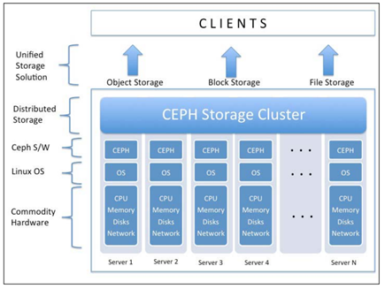
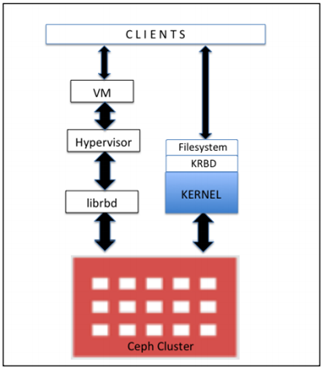
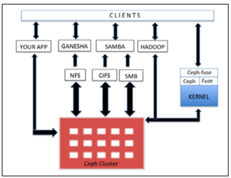
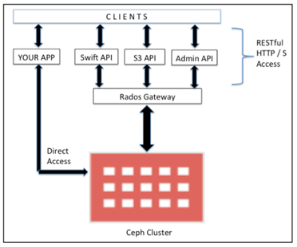

# Ceph – Phần 1: Tổng quan về Ceph
---

## Tổng quan về Ceph
### Giới thiệu
Ceph là 1 project mã nguồn mở, cung cấp giải pháp data storage. Ceph cung cấp hệ thống lưu trữ phân tán mạnh mẽ, tính mở rộng, hiệu năng cao, khả năng chịu lỗi cao. Xuất phát từ mục tiêu, Ceph được thiết kết với khả năng mở rộng cao, hỗ trợ lưu trữ tới mức exabyte cùng với tính tương thích cao với các phần cứng có sẵn

Ceph nối bật khi ngành công nghiệp và storage phát triển và mở rộng. Hiện nay, các nền tảng hạ tầng đám mây public, private, hybird cloud dần trở nên phổ biến và to lớn. Ceph trở thành giải pháp nổi bật cho các vấn đề đang gặp phải.

Phần cứng là thành phần quyết định hạ tầng cloud và Ceph đáng ứng vấn đề gặp phải, cung cấp hệ thống lưu trữ mạnh mẽ, độ tin cậy cao.

__Nguyên tắc cơ bản của Ceph:__

+ Khả năng mở rộng tất cả thành phần

+ Tính chịu lỗi cao

+ Giải pháp dựa trên phần mềm, hoàn toàn mở, tính thích nghi cao

+ Chạy tương thích với mọi phần cứng

Ceph xây dựng kiến trúc mạnh mẽ, tính mở rộng cao, hiệu năng cao, nền tảng mạnh mẽ cho doanh nghiệp, giảm bớt sự phụ thuộc vào phần cứng đắt tiền.

Ceph universal storage system cung cấp khả năng lưu trữ trên block, file, object, cho phép custom theo ý muốn.

Nền tảng Ceph xây dựng dựa trên object, tổ chức blocks. Tất cả các kiểu dữ liệu, block, file đều được lưu trên object thuộc Ceph cluster. Object storage là giải pháp cho hệ thống lưu trữ truyền thống, cho phép xây dựng kiến trúc hạ tầng độc lập với phần cứng. Ceph quản lý trên mức object, nhân bản obj toàn cluster, nâng cao tính bảo đảm. Tại Ceph, object sẽ không tồn tại đường dẫn vật lý, kiến obj linh hoạt khi lưu trữ, tạo nền tảng mở rộng tới hàng petabyte-exabyte.

### Ceph và tương lai của hệ thống lưu trữ

Theo thống kế, khối lượng dữ liệu lưu trữ tăng lên nhiều lần theo hàng năm. Theo số liệu con số lên tới 40-60 % và có thời điểm lên tới gấp đôi. Từ đó sinh ra nhiều vấn đề cần quan tâm. Như tính thống nhất, tính phân tán, hiệu năng, sự mở rộng.

Ceph storage system là giải pháp nổi bật cho vấn đề tăng trưởng dữ liệu toàn cầu. Với các đặc điểm nổi bật như tính thống nhất, phân phối, chí phí đầu tư hợp lý, tiềm năng cho hiên tại và tương lai. Được tích hợp với kernel, đây là đặc điểm kiến Ceph vượt trội hơn các giải pháp storage hiện tại.

### Ceph – Giải pháp cloud storage

Thành phần quan trọng để phát triển cloud chính là storage. Cloud cần storage để phát triển. Đồng thời, các giải pháp lưu trữ truyền thống đã dần tới giới hạn (chí phí, kiến trúc, tính mở rộng ..). Ceph trở thành giải pháp để giải quyết vấn để đang gặp phải đáp ứng nhu cầu của cloud, hỗ trợ tốt các nền tảng cloud nổi bật như OpenStack, CloudStack, OpenNebula. Đội ngũ phát triển và công tác Ceph bao gồm Canonical, Red Hat, SUSE, đều là những nhà cung cấp lớn, trau chuốt hoàn thiện Ceph, khiến sản phẩm luôn đi trước, bắt kịp thời đại, tương thích cao với Linux, thành 1 trong những hệ thống ưu tú để xây dựng storage backend.

### Ceph – Giải pháp software-defined

Để tiết kiệm chi phí, Ceph cung cấp giải pháp dựa trên phần mềm Software-defined Storage (SDS). Cung cấp giải phái cho những khách hãng đã có sẵn hạ tầng lớn, không mong muốn đâu tư thêm nhiều chi phí. SDS hỗ trợ tốt trên nhiều phấn cứng từ bất kỳ nhà cung cấp. Mang đến các lợi thế như Low cost, reliability, và scalability.

### Ceph – Giải pháp lưu trữ thống nhất

Ceph mang đến giải pháp lưu trữ thống nhất bao gồm file-based và block-based access truy cập duy nhất qua 1 nền tảng. Đáp ứng tốt sự tăng trưởng dữ liệu hiện tại và cả trong tương lai. Ceph xây dựng &quot;true unified storage solution&quot; bao gồm object, block, file storage và đồng bộ qua 1 nền tảng dựa trên phần mềm , hỗ trợ lưu trữ các luồng dữ liệu lớn, khống có cấu trúc. Lợi dụng điểm mạnh của ceph, toàn bộ block hay file storage đều được lưu trữ trong 1 đối tượng thông mình từ Ceph.

Ceph quản lý object, hỗ trợ block, file storage. Object trong ceph được lưu trữ riêng biệt, và hỗ trợ mở rộng không giới hạn bằng cách lược bỏ metadata. Để làm được điều đó, ceph sử dụng thuật toán động để tính toán, lưu trữ, tìm kiếm dữ liệu.

### Kiến trúc thế hệ mới

Hệ thống lưu trữ truyền thống không có phương pháp quản lý metadata thông minh. Cơ bản, Metadata là thông tin về dữ liệu, quyết định data sẽ được viết và đọc tại đâu. Traditional storage systems cần 1 trung tâm quan lý, tìm kiếm thông tin về metadata. Khi mỗi client yêu cầu hoạt động read, write – storage sẽ tìm kiếm vị trí data trong 1 bảng medata lớn. Với storage system nhỏ độ trễ là không lớn nhưng đối storage system lớn thì độ trễ là rất cao, hạn chế sự mở rộng.

Ceph không xây dựng theo phương pháp truyền thống, nó sử dụng 1 kiến trúc mới. Sử dụng lưu trữ theo thuật toán động &quot;CRUSH algorithm&quot;. CRUSH viết tắt &quot;Controlled Replication Under Scalable Hashing&quot;. Thay vì tìm kiếm metadata theo table trên mỗi request, thuật toán CRUSH sẽ dựa trên yêu cầu, tính toán vị trí data =&gt; cải thiện tốc độ. Hơn thế, thuật toán sẽ phân tán tới các cluster node, tận dụng sức mạnh lưu trữ phân tán. CRUSH quản lý metadata tốt hơn so với truyền thống.

Bên cạnh, CRUSH có khả năng nhận thức riêng về hạ tầng. Hiếu được mối quan hệ giữa các thành phần trong hạ tầng như system disk, pool, node, rack, power board, switch, and data center row, to the data center room and further. Khi cá thành phần xảy ra lỗi, CRUSH sẽ lưu trữ bản sao data và nhân rộng chúng đến các phân vùng trong bộ nhớ, kiến data luôn sẵn sàng. Đồng thời CRUSH cho phép Ceph tự quản trị và tự sửa lỗi, CRUSH sẽ tự sửa lỗi data, nhân rộng chúng trong cluster. Tại mọi thời điểm sẽ có hơn 1 bản sao lưu data phân tán trong cluster. Vì vậy, với CRUSH ta sẽ tạo ra hạ tầng lưu trữ đảm bảo, đáng tin cậy. Sử dụng Ceph tăng tính mở rộng, đảm bảo storage system.

### Raid – Kết thúc của kỷ nguyên

Công nghệ Raid được ứng dụng cho Storage rất nhiều năm. Đây là công nghệ thành công nhất trong lĩnh vực tái tạo, chịu lỗi về dữ liệu. Tuy nhiên, công nghệ raid đã tới giới hạn. Thời điểm hiện tại, nó đã bắt đầu xuất hiện những điểm yếu rõ rệt khi ứng dụng nhưng công nghệ mới. Công nghệ sản xuất ổ cứng ngày càng hiện đại với giá thành giảm dần. Dung lượng dữ liệu đã lên tới 4TB-6TB, và tăng dần theo từng năm. Cùng với khối lượng càng lớn, việc tái tạo dữ liệu = raid càng tốn nhiều thời gian, mất tới vài tiêng để sửa lỗi. Và nếu hỏng nhiều thiết bị cùng lúc, việc sửa lỗi sẽ tốn đến ngày, tháng để khôi phục và tốn nhiều tài nguyên. Hơn hết Raid sử dụng nhiều tài nguyên, tăng TCO, và khi storage đến giới hạn, nó sẽ lại đẩy chi phí đầu tư lên. Đồng thời khi đầu tư Raid, ta phải quan tâm đến disk size, rpm, loại việc lựa chọn sẽ ảnh hưởng đến hiệu năng storage.

Việc sử dụng raid kéo theo thiết bị phần cứng đắt tiền – Raid cards và có thể phát sinh lỗi khi không thế lưu trữ thêm data, và ta không thể thêm dung lượng kể cả khi ta có tiền. Đồng thời Raid 5 có thể chịu lỗi 1 ổ, Raid 6 2 ổ, nếu có nhiều hơn, việc phục hồi data sẽ trở nên rất khó khăn hoặc không thể. Và raid chỉ có thể bảo vệ lỗi trên disk, còn các lỗi nhề network, hardware, os … là điều không thể.

Ceph storage system sẽ là giải pháp cho nhưng vấn đề trên. Về tính đảm bảo, Raid sẽ tự nhân bản thuật toán, không phụ thuộc raid. Ceph is a softwaredefined storage, vì vậy, ta sẽ không cần sử dụng thiết bị chuyên dụng, đồng thời Ceph nhân bản data theo config, vì thế người quản trị sẽ dễ dàng định nghĩa số lượng bản sao, tối ưu phần cứng, dễ dang quản lý. Đồng thời Ceph có khả năng chịu lỗi nhiều hơn 2 disk, với tốc độ khôi phục đang ngạc nhiên, vì dữ liệu trong ceph không phân chi bản chính bản phụ. Đồng thời Ceph có thể lưu trữ khỗi lượng dữ liệu nhiều hơn dựa vào thuật toán CRUSH, vào quản trị thông qua CRUSH maps.

Bên cạnh phương pháp nhân bản, Ceph cung cấp &quot;erasure-coding technique&quot;. Kỹ thuật này yêu cầu ít storage space khi so sánh với replicated pool. Khi xử lý, data sẽ được khôi phục và tái tạo = erasure-code calculation. Ta có thể sử dụng đồng thời 2 phương pháp trong storage.

### Ceph block storage

Block storage là 1 phương thức sử dụng trong storage area network (SAN). Tại đây, data lưu trữ dạng volumes, dạng block, đưa vào các node. Cung cấp khả năng lưu trữ lớn, với sự đảm bảo cao, hiệu năng cao. Với các block, volumes sẽ được map tới OS, được kiểm soát bới filesystem layout.

Ceph giới thiệu giao thức mới RBD - Ceph Block Device. RBD cung cấp sự bảo đảm, tính phân phối, hiệu năng cao trên block storage disk tới client. RBD blocks chia thành nhiều obj, phân tán toàn Ceph cluser, cung cấp tính bảo đảm, hiệu năng cao. RBD hỗ trợ Linux kernel, và được tích hợp với Linux kernel, cung cấp tính năng snapshot tốc độ cao, nhẹ, copy-on-write cloning, and several others. Hỗ trợ in-memory caching, nâng cao hiệu năng.

Ceph RBD hỗ trợ image size tới 16EB. Image có thể là disk vật lý, máy ảo, … Các công nghệ KVM, Zen hỗ trợ đầy đẩy RBD, tăng tốc máy ảo. Ceph block hỗ trợ đầy đủ nền tảng ảo hóa mới OpenStack, CloudStack,..

### Ceph filesystem

Ceph filesystem hay CephFS, là POSIX-compliant filesystem, được sử dụng trong Ceph storage cluster sử dụng để lưu trữ user data. CephFS hỗ trợ tốt Linux kernel driver, kiến CephFS tương thích tốt với các nền tảng Linux OS. CephFS lưu data và medata riêng biệt, cung cấp hiệu năng, tính bảo đảm cho app host nằm trên nó

Trong Ceph cluster, Ceph fs lib (libcephfs) chạy trên Rados library (librados) – giao thức thuộc Ceph storage - file, block, and object storage. Để sử dụng CephFS, cần ít nhất 1 Ceph metadata server (MDS) để chạy cluster nodes. Tuy nhiên, sẽ không tốt khi chỉ có 1 MDS server nó sẽ ảnh hưởng tính chịu lỗi Ceph. Khi cấu hình MDS, client có thể sử dụng CephFS theo nhiều cách. Để mount Cephfs, client cần sử dụng Linux kernel hoặc ceph-fuse (filesystem in user space) drivers provided by the Ceph community.

Bên cạnh, Client có thể sử dụng phần mềm thứ 3 như Ganesha for NFS and Samba for SMB/CIFS. Phần mềm cho phép tương tác với &quot;libcephfs&quot;, bảo đảm lưu trữ user data phân tán trong Ceph storage cluster. CephFS có thể sử dụng cho Apache Hadoop File System (HDFS). Sử dụng libcephfs component to store data to the Ceph cluster. Để thực hiện, Ceph community cung cấp CephFS Java interface for Hadoop and Hadoop plugins. The libcephfs và librados components rất linh hoạt và ta có thể xây dựng phiên bản tùy chỉnh, tương tác với nó, xây dựng data bên dưới Ceph storage cluster.

### Ceph object storage

Phương pháp lưu trữ data dạng object thay vì file, blocks truyền thống. Object-based storage nhận được nhiều sự chú ý trong storage industry.

Các tổ chức mong muốn giải pháp lưu trữ toàn diện cho lượng data khổng lồ, Ceph là giải pháp nổi bật vì nó là true object-based storage system. Ceph phân phối obj storage system, cung cấp object storage interface thông qua Ceph&#39;s object gateway, được biệt là RADOS gateway (radosgw).

RADOS gateway (radosgw) sử dụng librgw (the RADOS gateway library) và librados, cho phép app thiết lập kết nối với Ceph object storage. Ceph cung cấp giải pháp lưu trữ ổn định, và có thể truy cập thông qua RESTful API.

The RADOS gateway cung cấp RESTful interface để sử dụng cho application lưu trữ

data trên Ceph storage cluster. RADOS gateway interfaces gồm:

+ Swift compatibility: This is an object storage functionality for the OpenStack Swift API

+ S3 compatibility: This is an object storage functionality for the Amazon S3 API

+ Admin API: This is also known as the management API or native API, which can be used directly in the application to gain access to the storage system for management purposes

Để truy câp Ceph object storage system, ta có thể sử dụng RADOS gateway layer. librados software libraries cho phép user app truy tập trực tiếp đến Ceph = C, C++, Java, Python, and PHP. Ceph object storage has multisite capabilities, nó cung cấp giải pháp khi gặp sự cố. Các object storage configuration có thể thực hiện bởi Rados hoặc federated gateways.

### Tổng kết

Ceph gần như dẫn dầu trong các công nghệ storage mới. Được thiết kế để vượt qua giới hạn mà storage gặp phải hiện nay. Là giải pháp mở, software-defined storage, tương thích nhiều phân cứng. Cung cấp nhiều giao diện với người dùng, tăng tính linh hoạt. Ceph mạnh mẽ hơn công nghệ Raid hiện tại, vượt qua các giới hạn của RAID.
Mỗi thành phần trong Ceph đều bảo đảm và hỗ trợ HA. Điểm mạnh nhất của Ceph là tính thống nhất, cung cấp giải pháp toàn diện block, file, and object storage. Phù hợp lưu trữ cho cả small file và bigfile mà không có bất cứ trục trặc về hiệu suất.
Ceph là hệ thống lưu trữ phân tán. Client có thể nhanh trong tiếp cận Ceph. Nó không tuần theo phương pháp truyền thống, ứng dụng kỹ thuật mới, cho phép client tinh toán động. Tăng tốc nâng cao hiệu năng cho client. Hơn thế, dữ liệu được lưu trong Ceph Cluster được tổ chức rõ ràng, tự động. Cả client và admin đều không phải lo lằng về sự cố, Ceph's intelligent system sẽ chịu trách nhiệm xứ lý. Ceph được thiết kế để tự quản trị, tự sửa lỗi. Khi xảy ra sự cố, Ceph vượt qua với sự đảm bảo tốt nhất. Ceph phát hiện và sửa lỗi tất cả sự cố trên disk, node, network, rack, data center row, data center, and even different geographies.