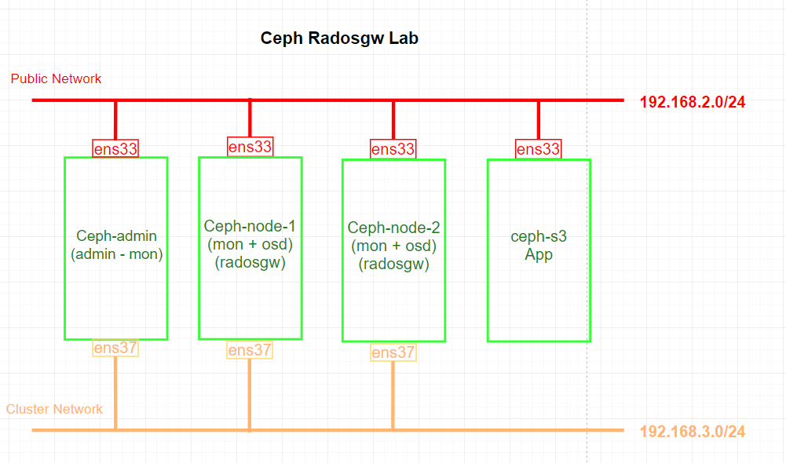
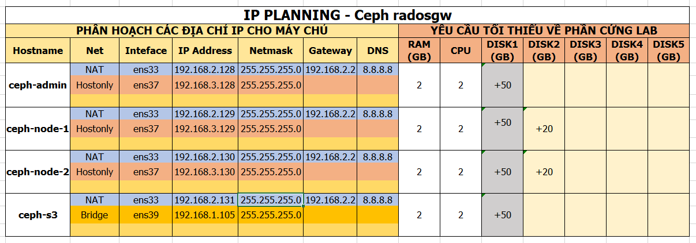

# Thiết lập Radosgw trên Ceph Cluster
---
## Chuẩn bị
### Sơ đồ

### Tài nguyên
__Yều cầu 3 node chạy ceph, 1 node giả lập app sử dụng s3 API__

> Tất cả chạy CentOS 7

## Cài đặt
### Phần 1: Cài đặt Ceph
[Cài đặt Ceph theo Lab 3 node](ceph-3node-lab.md)

> Thiết lập IP theo lab hiện tại

### Phần 2: Thiết lập Ceph Radosgw
> Thực hiện trên __ceph-admin__

#### Bước 1: Thiết lập tại ceph-admin (Node có quyền admin)

Truy cập ceph-admin
```
ssh root@ceph-admin
```

Truy cập ceph cluster directory
```
cd cluster/
```
#### Bước 2: Tạo rados gateway
Tạo 2 rados gateway:
- 1 trên ceph-node-1
- 1 trên ceph-node-2

```
ceph-deploy rgw create ceph-node-1 ceph-node-2
```

> API gateways chạy trên port 7480.

> Sử dụng 2 gateway trong trường hợp cần tới HA, load balancing

__Kết quả__

pic 1

### Phần 3: Tạo radosgw user
> Thực hiện trên __ceph-admin__

#### Tổng quát
Để có thể sử dụng Ceph object storage, ta cần tạo user truy cập Radosgw. User được định danh bằng access và secret key, sử dụng cho mục đích truy cập, thực hiện các hoạt động trên  Ceph object storage.

#### Bước 1: Truy cập node admin
Truy cập node có quyền admin trong Ceph cluster
```
ssh root@ceph-admin
```
#### Bước 2: Tạo user

```
[root@ceph-admin cluster]# radosgw-admin user create --uid=lacoski --display-name="my user lacoski"
{
    "user_id": "lacoski",
    "display_name": "my user lacoski",
    "email": "",
    "suspended": 0,
    "max_buckets": 1000,
    "auid": 0,
    "subusers": [],
    "keys": [
        {
            "user": "lacoski",
            "access_key": "UDW5NH3UZ83CK1W0U2PW",
            "secret_key": "BjPiwiRRdTmgK50SjeDCmgVgfNWjfPgTIRTTr4Zq"
        }
    ],
    "swift_keys": [],
    "caps": [],
    "op_mask": "read, write, delete",
    "default_placement": "",
    "placement_tags": [],
    "bucket_quota": {
        "enabled": false,
        "max_size_kb": -1,
        "max_objects": -1
    },
    "user_quota": {
        "enabled": false,
        "max_size_kb": -1,
        "max_objects": -1
    },
    "temp_url_keys": []
}

```
#### Kiểm tra lại thông tin user
```
[root@ceph-admin cluster]# radosgw-admin user info --uid=lacoski
{
    "user_id": "lacoski",
    "display_name": "my user lacoski",
    "email": "",
    "suspended": 0,
    "max_buckets": 1000,
    "auid": 0,
    "subusers": [],
    "keys": [
        {
            "user": "lacoski",
            "access_key": "UDW5NH3UZ83CK1W0U2PW",
            "secret_key": "BjPiwiRRdTmgK50SjeDCmgVgfNWjfPgTIRTTr4Zq"
        }
    ],
    "swift_keys": [],
    "caps": [],
    "op_mask": "read, write, delete",
    "default_placement": "",
    "placement_tags": [],
    "bucket_quota": {
        "enabled": false,
        "max_size_kb": -1,
        "max_objects": -1
    },
    "user_quota": {
        "enabled": false,
        "max_size_kb": -1,
        "max_objects": -1
    },
    "temp_url_keys": []
}
```
### Phần 4: Kiểm tra user cung cấp bởi Radosgw
> Thực hiện trên __ceph-admin__ (có thể trên ceph-client)

__Cài đặt gói__
```
yum -y install python-boto
```

__Tạo python script "/root/cephs3test.py"__
```
[root@ceph-admin ~]# vim cephs3test.py3

# content
import boto
import boto.s3.connection

access_key = 'UDW5NH3UZ83CK1W0U2PW'
secret_key = 'BjPiwiRRdTmgK50SjeDCmgVgfNWjfPgTIRTTr4Zq'
conn = boto.connect_s3(
   aws_access_key_id = access_key,
   aws_secret_access_key = secret_key,
   host = 'ceph-node-1', port = 7480,is_secure=False, calling_format = boto.s3.connection.OrdinaryCallingFormat(),)

bucket = conn.create_bucket('my-new-bucket')
for bucket in conn.get_all_buckets():
   print "{name} {created}".format(name = bucket.name,created = bucket.creation_date,)
```
> Chú ý: 2 key access và secret

> Chú ý: Host = 'radosgw host' lựa chọn phù hợp

__Chạy script__
```
python /root/cephs3test.py
```
__Kết quả (tương tự)__
```
my-new-bucket 2018-02-27T04:56:33.729Z
lacoski 2018-02-27T04:48:46.508Z
```

__Kiểm tra bằng node ceph-admin__
```
[root@ceph-admin ~]# radosgw-admin bucket list
[
    "my-new-bucket",
    "lacoski"
]
```

__Xóa bucket test__
```
radosgw-admin bucket rm my-new-bucket
```

### Phần 5: Truy cập Ceph object storage thông qua s3 interface
Ở đây sẽ truy cập Ceph object thông qua S3 API tương thích.
> Thực hiện các bước sau tại __ceph-s3 node__

#### Thiết lập file host
Thiết lập file host trên ceph-s3 node
```
[root@ceph-s3 ~]# vim /etc/hosts
```
Nội dung
```
192.168.2.136 ceph-admin

192.168.2.137 ceph-node-1 cephgw.test.lab

192.168.2.138 ceph-node-2

192.168.2.144 ceph-s3
```
#### Bước 1: Cài đặt s3cmd
```
yum install epel-release -y
yum install python-pip -y
pip install s3cmd
```

Kiểm tra version s3cmd
```
[root@ceph-s3 ~]# s3cmd --version
s3cmd version 2.0.1
```

#### Bước 2: Thiết lập kết nối s3cmd với Ceph thông qua S3 API
> Sử dụng user vừa tạo tại phần 2 để truy cập Radosgw

```
[root@ceph-s3 ~]# s3cmd --configure

Enter new values or accept defaults in brackets with Enter.
Refer to user manual for detailed description of all options.

Access key and Secret key are your identifiers for Amazon S3. Leave them empty for using the env variables.
Access Key [UDW5NH3UZ83CK1W0U2PW]:
Secret Key [BjPiwiRRdTmgK50SjeDCmgVgfNWjfPgTIRTTr4Zq]:
Default Region [US]:

Use "s3.amazonaws.com" for S3 Endpoint and not modify it to the target Amazon S3.
S3 Endpoint [cephgw.test.lab:7480]:

Use "%(bucket)s.s3.amazonaws.com" to the target Amazon S3. "%(bucket)s" and "%(location)s" vars can be used
if the target S3 system supports dns based buckets.
DNS-style bucket+hostname:port template for accessing a bucket [cephgw.test.lab:7480]: cephgw.test.lab:7480

Encryption password is used to protect your files from reading
by unauthorized persons while in transfer to S3
Encryption password [thanh]:
Path to GPG program [/bin/gpg]:

When using secure HTTPS protocol all communication with Amazon S3
servers is protected from 3rd party eavesdropping. This method is
slower than plain HTTP, and can only be proxied with Python 2.7 or newer
Use HTTPS protocol [No]: No

On some networks all internet access must go through a HTTP proxy.
Try setting it here if you can't connect to S3 directly
HTTP Proxy server name:

New settings:
  Access Key: UDW5NH3UZ83CK1W0U2PW
  Secret Key: BjPiwiRRdTmgK50SjeDCmgVgfNWjfPgTIRTTr4Zq
  Default Region: US
  S3 Endpoint: cephgw.test.lab:7480
  DNS-style bucket+hostname:port template for accessing a bucket: cephgw.test.lab:7480
  Encryption password: thanh
  Path to GPG program: /bin/gpg
  Use HTTPS protocol: False
  HTTP Proxy server name:
  HTTP Proxy server port: 0

Test access with supplied credentials? [Y/n] y
Please wait, attempting to list all buckets...
Success. Your access key and secret key worked fine :-)

Now verifying that encryption works...
Success. Encryption and decryption worked fine :-)

Save settings? [y/N] y
Configuration saved to '/root/.s3cfg'
```
> Kết nối s3 API thành công với Ceph Radosgw

> Lưu ý cả thiết lập: Access Key, Secret Key, S3 Endpoint, S3 system supports dns based buckets, Use HTTPS protocol [No]: No
__Tạo bucket thông qua s3 cmd__

```
[root@ceph-s3 ~]# s3cmd ls
[root@ceph-s3 ~]#  s3cmd mb s3://first-bucket
Bucket 's3://first-bucket/' created
[root@ceph-s3 ~]# s3cmd put /etc/hosts s3://first-bucket
upload: '/etc/hosts' -> 's3://first-bucket/hosts'  [1 of 1]
 287 of 287   100% in    1s   149.55 B/s  done
```

### Phần 6: Kiểm chứng
#### Kiểm tra tại Ceph storage cluste
> Thực hiện tại node có quyền admin trong ceph

Kiểm tra bucket vừa tạo thông qua s3 interface tại ceph-s3 node
```
[root@ceph-admin cluster]# radosgw-admin bucket list --bucket=first-bucket
[
    {
        "name": "hosts",
        "instance": "",
        "namespace": "",
        "owner": "lacoski",
        "owner_display_name": "my user lacoski",
        "size": 287,
        "mtime": "2018-03-01 06:54:26.738998Z",
        "etag": "4913007553cb4d9f13babc6cec275407",
        "content_type": "text\/plain",
        "tag": "f0332421-32af-4fc3-8a3e-c55a5b365b60.84105.9",
        "flags": 0,
        "user_data": ""
    }
]
```
> The Ceph Object Gateway supports a subset of the Amazon S3 policy language applied to buckets. [Link](http://docs.ceph.com/docs/master/radosgw/bucketpolicy/)

## Nguồn
http://docs.ceph.com/docs/master/radosgw/bucketpolicy/#
http://s3tools.org/usage
http://s3tools.org/s3cmd
http://s3tools.org/s3cmd-howto
https://linuxconfig.org/getting-started-with-aws-s3cmd-command-by-examples
