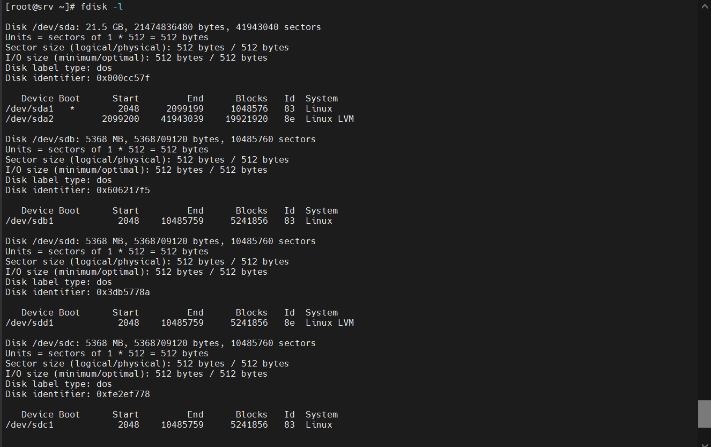
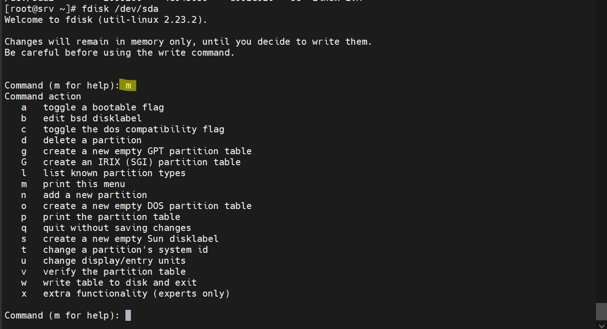
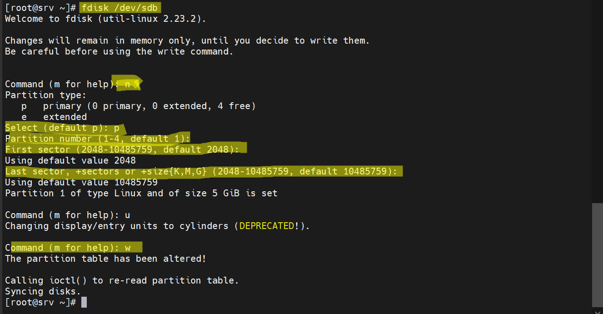

# Command fdisk in linux

`fdisk` -- format disk là định dạng đĩa là một lệnh điều khiển bằng hộp thoại trong Linux được sử dụng để tạo và thao tác với disk partition table - bảng phân vùng đĩa. Nó được sử dụng để xem, tạo, xóa, thay đổi, thay đổi kích thước, sao chép và di chuyển các phân vùng trên ổ cứng bằng giao diện điều khiển bằng hộp thoại

`fdisk` cho phép bạn tạo tối đa bốn phân vùng chính và số lượng phân vùng hợp lý phụ thuộc vào kích thước của đĩa cứng bạn đang sử dụng. Nó cho phép người dùng:

* Để tạo không gian cho các phân vùng mới.
* Tổ chức không gian cho các ổ đĩa mới.
* Sắp xếp lại các ổ đĩa cũ.
* Sao chép hoặc di chuyển dữ liệu sang đĩa (phân vùng) mới.
```
fdisk [options] device
```
or
```
fdisk -l [device...]
```

## 1. View All Disk Partitions
Xem chi tiết cơ bản về tất cả các phân vùng có sẵn trong hệ thống. Được sử dụng để liệt kê các phân vùng trên hệ thống của bạn và xem tên `/dev` của chúng.
```
fdisk -l
```

</br>

## 2. Xem phân vùng trên một đĩa cụ thể
Lệnh dưới đây được sử dụng để xem tất cả các phân vùng đĩa trên thiết bị `/dev/sda`.
</br>

## 3. View All
Để xem tất cả lệnh có sẵn trong lệnh fdisk, bạn có thể sử dụng phân vùng `/dev/sda` với lệnh fdisk.
```
fdisk /dev/sda
```

</br>

Nhập `m` để xem tất cả các hoạt động có thể thực hiện trên `/dev/sda`. Sau khi nhấn `m`, bạn sẽ nhận được:
</br>
## 4. Create a Hard Disk Partition
Đối với điều này, hãy vào bên trong phân vùng ổ cứng là phân vùng /dev/sda và sử dụng lệnh sau:

</br>

Bây giờ bạn phải gõ `n` để tạo phân vùng mới, sau đó gõ `p` để tạo phân vùng chính và `e` để tạo phân vùng mở rộng hoặc phân vùng logic tùy thuộc vào loại phân vùng cần tạo.

Chạy lệnh `w` để viết các thay đổi và khởi động lại hệ thống của bạn.

## 5. Delete a Hard Disk Partition
Để xóa một phân vùng cho đĩa cứng và giải phóng dung lượng bị chiếm bởi phân vùng đó, ví dụ `/dev/sdb`. Đi tới menu lệnh bằng cách sử dụng sau:
```
fdisk /dev/sdb
```

và sau đó gõ d để chuyển đến menu xóa phân vùng. Nó sẽ nhắc số phân vùng bạn muốn xóa (nhập số).

</br>
</br>
Đã thực thực hiện xóa Partition xong.

## 6. Cách xem kích thước Phân vùng của bạn:
```
fdisk -s /dev/sda
```

</br>


Để kiểm tra trang thủ công của lệnh fdisk, hãy sử dụng lệnh sau:
```
man fdisk 
```

Để xem thông báo trợ giúp và danh sách tất cả các tùy chọn, hãy sử dụng tùy chọn lệnh sau:
```
fdisk -h
```


## Nguồn: https://github.com/huydv398/Note-CEPH-Storage