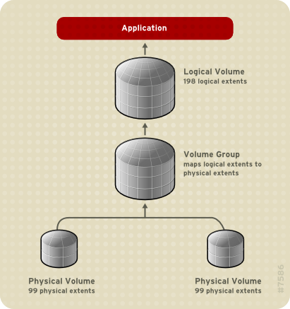
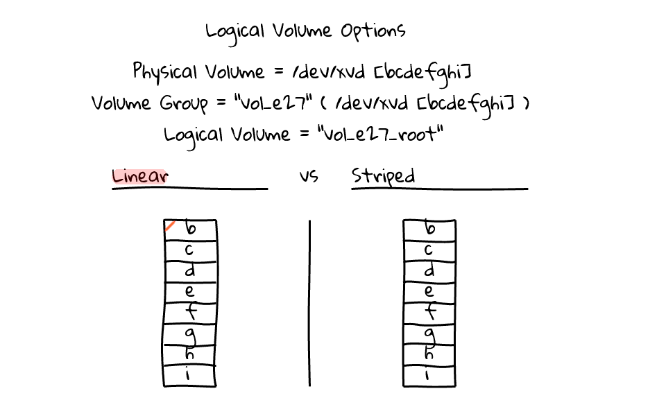
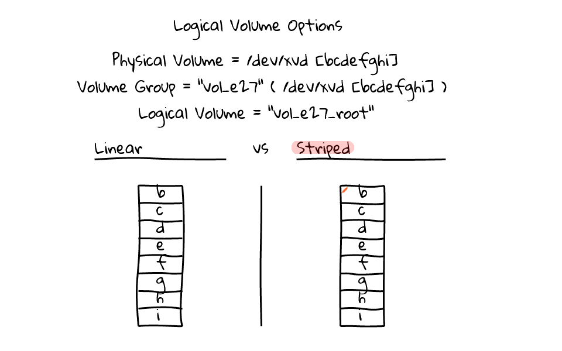
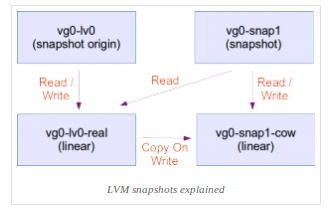

# LVM Logical Volume
## Giới thiệu
Trong LVM, volume group chia thành logical volumes. Từ đó chia thành 3 loại LVM logical volumes:
- linear volume.
- striped volume.
- mirrored volume.

## 1. Linear Volume
Linear volume tập hợp các physical volumes thành 1 logical volume, physical storage được nối lại với nhau

### Mô hình

### Cách ghi dữ liệu

## 2. Striped Logical Volumes
Khi dữ liệu được ghi xuong LVM logical volume, File system sẽ đặt data nằm suốt các physical volume.

Có thể kiếm soát cách data được ghi xuống physical volumes băng cách tạo striped logical volume.

Với khối lượng đọc ghi lớn, khi sử dụng phương pháp này hiệu năng data IO sẽ được nâng cao.
Striped Logical nâng cao hiệu năng = ghi data đến 1 số các physical volumes chỉ đinh trước - với striping, IO thực hiện song song.

### Mô hình

### Cách ghi dữ liệu

## 3. Mirrored Logical Volume
Mirrored Logical Volume duy trì bản sao dữ liệu giống nhau trên thiết bị khác nhau. Khi data được ghi tới 1 device, nó cũng sẽ được ghi tới 1 thiết bị khác (mirroring the data).
Phương pháp cung cấp tính bảo vệ dữ liệu khi thiết bị lỗi.

LVM hỗ trợ mirrored volumes. Khi ta tạo mirrored logical volume, LVM sẽ chắc chắn data được ghi tới vị trí mirrored tại thiết bị khác.
Với LVM, ta có thể tạo mirrored logical volume với nhiều mirrors.

LVM mirror duy trì lượng log nhỏ, sử dụng để theo dõi phân vùng được đồng bộ với mirror (1 hoặc nhiều).

### Mô hình

## Snapshot Volume
LVM snapshot cung cấp tính năng cho phép tạo virtual images của thiết bị được chọn lập tức mà không làm gián đoạn các dịch vụ đang chạy.

Khi thay đổi được thực hiện sau khi thiết bị đã được snapshot, tính năng snapshot sẽ tạo bản copy khu vực, cho phép khôi phục khi cần.

Vì Snapshot chỉ sao chép phân vùng dữ liệu thay đổi sau khi snapshot được tạo => yêu cầu khối lượng lưu trữ nhỏ. VD: đối với dữ liệu ít được thay đổi, bản snap chỉ nặng từ 3-5% khi so sánh với phiên bản gốc.

Nếu snapshot đầy, snapshot sẽ tự động xóa. Tính năng bảo đảm sẽ luôn có đủ không gian lưu FS. Vì vậy, yêu cầu giảm sát size của snapshot. Snapshots có thể thay đổi kích thước nhưng cần không gian để snapshot lớn dần, nếu không, nó sẽ vấn bị drop. Ngược lại nếu thây size snapshot lơn hơn yêu cầu => có thẻ giảm size snap tăng không gian.

**Sử dụng tính năng snapshot cho hoạt động**:
- Snapshots được sử dụng khi cần thực hiện backup logical volume mà không cần dừng hệ thống
- Có thể đọc ghi trên snapshot vì vậy có thể test application trên snapshot data, giữ cho data thực được bảo đảm.
- Có thể tạo snapshot trên máy ảo, phục vụ cho việc backup (KVM, VMware).

### Mô hình

## Cache Volume
Loại cache logical volume sử dụng LV nhỏ và nhanh, nâng cao hiệu năng LV to và chậm.

Thực hiện bằng cách lưu các block thường xuyên được sử dụng trên LV có tốc độ xử lý nhanh. LVM tạo small fast LV bằng Cache pool LV. Large slow LV = LV tiểu chuẩn.

Do yêu cầu từ dm-cache (kernel driver), LVM chia cache pool LV thành 2 thiết bị:
- Cache data LV
- Cache metadata LV

## Các loại phân vùng khác (Tham khảo thêm)
### THINLY-PROVISIONED SNAPSHOT VOLUME
### THINLY-PROVISIONED LOGICAL VOLUME
### Raid VOLUME

## Nguồn
[Link tham khảo - Redhat Docs](https://access.redhat.com/documentation/en-us/red_hat_enterprise_linux/6/html-single/logical_volume_manager_administration/index)
