# Triển khai tự động VMware Cloud Foundation Lab

## Sơ đồ hệ thống — VCF 5.2 Nested Lab

```
┌──────────────────────────────────────────────────────────────────────────────┐
│                         PHYSICAL INFRASTRUCTURE                              │
│               (Existing vCenter / ESXi — vSphere 7.0+)                       │
│  Resources: 8-12 vCPU · 384 GB RAM · 1.25 TB Storage · 1 Routable Portgroup  │
└──────────────────────────────┬───────────────────────────────────────────────┘
                               │
                               ▼
┌────────────────────────────────────────────────────────────────────────────────┐
│                        NESTED VCF 5.2 LAB ENVIRONMENT                          │
│                                                                                │
│  ┌──────────────────────────────────────────────────────────────────────┐      │
│  │              CLOUD BUILDER VM (vcf-m01-cb01)                         │      │
│  │              Deploys & configures VCF Management Domain              │      │
│  │              IP: 172.16.30.61 · OVA: 5.2 / 5.2.1 / 5.2.1.1           │      │
│  └──────────────────────────┬───────────────────────────────────────────┘      │
│                             │                                                  │
│                             ▼                                                  │
│  ┌──────────────────────────────────────────────────────────────────────┐      │
│  │               SDDC MANAGER VM (vcf-m01-sddcm01)                      │      │
│  │               Orchestrates lifecycle — deploy, patch, upgrade        │      │
│  │               IP: 172.16.30.62                                       │      │
│  └──────────────────────────┬───────────────────────────────────────────┘      │
│                             │                                                  │
│              ┌──────────────┼──────────────┐                                   │
│              ▼              ▼              ▼                                   │
│       ┌──────────────────┐ ┌──────────────────┐                                │
│       │ MANAGEMENT DOMAIN│ │  WORKLOAD DOMAIN │        NSX-T OVERLAY           │
│       │    vcf-m01       │ │    vcf-w01       │        NETWORKS                │
│       │  (4 ESXi hosts)  │ │  (4 ESXi hosts)  │    (172.30.34.0/24)            │
│       └────────┬─────────┘ └────────┬─────────┘                                │
│                │                    │                                          │
│       ┌────────┴────────────┬───────┴──────────────┐                           │
│       │                     │                      │                           │
│       ▼                     ▼                      ▼                           │
│  ┌──────────────────────────────────────────────────────────────────────────┐  │
│  │                              vCENTER SERVER                              │  │
│  │  Mgmt: vcf-m01-vc01 (172.16.30.67)    │  WLD: vcf-w01-vc01 (30.76)       │  │
│  ├───────────────────────────────────────┼──────────────────────────────────┤  │
│  │                                NSX-T MANAGER                             │  │
│  │  Mgmt VIP: vcf-m01-nsx01     (30.68)  │ WLD VIP: vcf-w01-nsx01 (30.77)   │  │
│  │  Mgmt Node1: vcf-m01-nsx01a  (30.69)  │ WLD Node1: vcf-w01-nsx01a(30.78) │  │
│  │                                       │ WLD Node2: vcf-w01-nsx01b(30.79) │  │
│  │                                       │ WLD Node3: vcf-w01-nsx01c(30.80) │  │
│  ├───────────────────────────────────────┼──────────────────────────────────┤  │
│  │                            NESTED ESXi HOSTS                             │  │
│  │  vcf-m01-esx01  (30.63) ~12 vCPU      │ vcf-w01-esx01  (30.72) ~8 vCPU   │  │
│  │  vcf-m01-esx02  (30.64)  96 GB RAM    │ vcf-w01-esx02  (30.73) 36 GB     │  │
│  │  vcf-m01-esx03  (30.65)  500 GB cap   │ vcf-w01-esx03  (30.74) 250 GB    │  │
│  │  vcf-m01-esx04  (30.66)  vSAN ESA     │ vcf-w01-esx04  (30.75)  ~        │  │
│  └───────────────────────────────────────┴──────────────────────────────────┘  │
│                                                                                │
│  ┌──────────────────────────────────────────────────────────────────────┐      │
│  │                        NETWORKING (172.16.0.0/16)                    │      │
│  │  Mgmt: 172.16.30.0/24 · vMotion: 172.30.32.0/24 · vSAN: 172.30.33.0  │      │
│  │  NSX-T TEP: 172.30.34.0/24 · Gateway: 172.16.1.53 · DNS: 172.16.1.3  │      │
│  └──────────────────────────────────────────────────────────────────────┘      │
└────────────────────────────────────────────────────────────────────────────────┘
```

### Scripts tự động

| Script | Mục đích |
|--------|---------|
| [`vcf-automated-lab-deployment.ps1`](vcf-automated-lab-deployment.ps1) | Triển khai Nested ESXi & Cloud Builder VM, sau đó triển khai VCF Management Domain (bringup) |
| [`vcf-automated-workload-domain-deployment.ps1`](vcf-automated-workload-domain-deployment.ps1) | Ủy quyền hosts & triển khai VCF Workload Domain qua SDDC Manager API |
| [`sample-vcf-mgmt-variables.ps1`](sample-vcf-mgmt-variables.ps1) | Mẫu cấu hình cho Management Domain |
| [`sample-vcf-wld-variables.ps1`](sample-vcf-wld-variables.ps1) | Mẫu cấu hình cho Workload Domain |

### Ảnh chụp màn hình

| Ảnh | Mô tả |
|-----|-------|
| [`screenshot-0.png`](screenshots/screenshot-0.png) | Sơ đồ topology logic của toàn bộ VCF nested lab |
| [`screenshot-1.png`](screenshots/screenshot-1.png) | Thực thi script — kiểm tra tiên quyết & xác nhận |
| [`screenshot-2.png`](screenshots/screenshot-2.png) | Triển khai Nested ESXi + Cloud Builder VM thành công |
| [`screenshot-3.png`](screenshots/screenshot-3.png) | vApp chứa tất cả 9 VM (8 ESXi + 1 Cloud Builder) |
| [`screenshot-4.png`](screenshots/screenshot-4.png) | Tiến trình bringup VCF Management Domain trong SDDC Manager |
| [`screenshot-6.png`](screenshots/screenshot-6.png) | Triển khai Management Domain thành công |
| [`screenshot-7.png`](screenshots/screenshot-7.png) | Đăng nhập SDDC Manager sau bringup |
| [`screenshot-8.png`](screenshots/screenshot-8.png) | Giao diện Commission Hosts upload JSON |
| [`screenshot-9.png`](screenshots/screenshot-9.png) | Triển khai Workload Domain trong SDDC Manager |
| [`screenshot-10.png`](screenshots/screenshot-10.png) | Script Workload Domain — kiểm tra tiên quyết |
| [`screenshot-11.png`](screenshots/screenshot-11.png) | Script Workload Domain — hoàn thành |
| [`screenshot-12.png`](screenshots/screenshot-12.png) | Tiến trình triển khai Workload Domain |
| [`screenshot-13.png`](screenshots/screenshot-13.png) | Triển khai Workload Domain thành công |
| [`screenshot-14.png`](screenshots/screenshot-14.png) | Toàn bộ inventory sau khi triển khai cả hai domain |

## Mục lục

* [Mô tả](#mô-tả)
* [Changelog](#changelog)
* [Yêu cầu](#yêu-cầu)
* [Cấu hình Management Domain](#cấu-hình-management-domain)
* [Cấu hình Workload Domain](#cấu-hình-workload-domain)
* [Ghi log](#ghi-log)
* [Ví dụ thực thi](#ví-dụ-thực-thi)
    * [Triển khai Nested ESXi và Cloud Builder VM](#triển-khai-nested-esxi-và-cloud-builder-vm)
    * [Triển khai VCF Management Domain](#triển-khai-vcf-management-domain)
    * [Triển khai VCF Workload Domain](#triển-khai-vcf-workload-domain)

## Mô tả

Tương tự các "Automated Lab Deployment Scripts" trước đây (như [ở đây](https://www.williamlam.com/2016/11/vghetto-automated-vsphere-lab-deployment-for-vsphere-6-0u2-vsphere-6-5.html), [ở đây](https://www.williamlam.com/2017/10/vghetto-automated-nsx-t-2-0-lab-deployment.html), [ở đây](https://www.williamlam.com/2018/06/vghetto-automated-pivotal-container-service-pks-lab-deployment.html), [ở đây](https://www.williamlam.com/2020/04/automated-vsphere-7-and-vsphere-with-kubernetes-lab-deployment-script.html), [ở đây](https://www.williamlam.com/2020/10/automated-vsphere-with-tanzu-lab-deployment-script.html) và [ở đây](https://williamlam.com/2021/04/automated-lab-deployment-script-for-vsphere-with-tanzu-using-nsx-advanced-load-balancer-nsx-alb.html)), script này giúp bất kỳ ai cũng có thể dễ dàng triển khai một "basic" VMware Cloud Foundation (VCF) trong môi trường Nested Lab phục vụ mục đích học tập và giáo dục. Tất cả các thành phần VMware cần thiết (ESXi và Cloud Builder VM) được tự động triển khai và cấu hình để cho phép VCF được triển khai và cấu hình bằng VMware Cloud Builder. Để biết thêm thông tin, vui lòng tham khảo [tài liệu VMware Cloud Foundation](https://techdocs.broadcom.com/us/en/vmware-cis/vcf.html) chính thức.

Dưới đây là sơ đồ những gì được triển khai trong giải pháp và bạn chỉ cần có môi trường vSphere hiện có được quản lý bởi vCenter Server với đủ tài nguyên (CPU, Memory và Storage) để triển khai lab "Nested" này. Để kích hoạt VCF (vận hành sau triển khai), vui lòng xem phần [Ví dụ thực thi](#ví-dụ-thực-thi) bên dưới.

Bạn đã sẵn sàng để bắt đầu với VCF rồi đấy! 😁

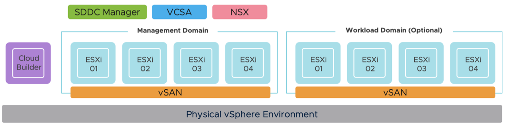

## Changelog

* **28/02/2025**
  * Đưa biến người dùng ra ngoài thành file cấu hình riêng
  * Sửa lỗi xây dựng spec Workload Domain cho triển khai dựa trên vLCM
  * Thêm hỗ trợ VCF 5.2.1.1
* **09/10/2024**
  * Thêm hỗ trợ VCF 5.2.1
    * Kích thước NSX Manager thay đổi từ `small` sang `medium` (cần cho 5.2.1 hoặc gặp lỗi triển khai)
* **10/07/2024**
  * Management Domain:
    * Thêm hỗ trợ VCF 5.2 (mật khẩu Cloud Builder 5.2 phải tối thiểu 15 ký tự)
  * Workload Domain:
    * Thêm hỗ trợ VCF 5.2
    * Thêm biến `$SeparateNSXSwitch` để chỉ định VDS riêng cho NSX (tương tự tùy chọn Management Domain)
* **28/05/2024**
  * Management Domain:
    * Tái cấu trúc sinh JSON VCF Management Domain linh hoạt hơn
    * Tái cấu trúc mã license hỗ trợ cả key license hoặc license sau
    * Thêm `clusterImageEnabled` vào JSON mặc định sử dụng biến `$EnableVCLM`
  * Workload Domain:
    * Thêm biến `$EnableVCLM` để kiểm soát image dựa trên vLCM cho vSphere Cluster
    * Thêm biến `$VLCMImageName` để chỉ định image vLCM mong muốn (mặc định dùng Management Domain)
    * Thêm biến `$EnableVSANESA` để chỉ định bật/tắt vSAN ESA
    * Thêm biến `$NestedESXiWLDVSANESA` để chỉ định Nested ESXi VM cho WLD dùng vSAN ESA, yêu cầu NVME controller thay vì PVSCSI controller (mặc định)
    * Tái cấu trúc mã license hỗ trợ cả key license hoặc license sau
* **27/03/2024**
  * Thêm hỗ trợ license sau (chế độ dùng thử 60 ngày)
* **08/02/2024**
  * Thêm script bổ sung `vcf-automated-workload-domain-deployment.ps1` để tự động hóa triển khai Workload Domain
* **05/02/2024**
  * Cải thiện mã thay thế cho các mạng ESXi vMotion, vSAN & NSX CIDR
  * Đổi tên biến (`$CloudbuilderVMName`,`$CloudbuilderHostname`,`$SddcManagerName`,`$NSXManagerVIPName`,`$NSXManagerNode1Name`) thành (`$CloudbuilderVMHostname`,`$CloudbuilderFQDN`,`$SddcManagerHostname`,`$NSXManagerVIPHostname`,`$NSXManagerNode1Hostname`) để thể hiện đúng giá trị mong đợi (Hostname và FQDN)
* **03/02/2024**
  * Thêm hỗ trợ định nghĩa tài nguyên độc lập (cpu, memory và storage) cho Nested ESXi VM dùng với Management và/hoặc Workload Domain
  * Tự động sinh file JSON ủy quyền host Workload Domain (vcf-commission-host-api.json) cho SDDC Manager API (UI sẽ có `-ui` trong tên file)
* **29/01/2024**
  * Thêm hỗ trợ [VCF 5.1](https://blogs.vmware.com/cloud-foundation/2023/11/07/announcing-availability-of-vmware-cloud-foundation-5-1/)
  * Tự động khởi động bringup VCF Management Domain trong SDDC Manager sử dụng file JSON (vcf-mgmt.json)
  * Thêm hỗ trợ triển khai Nested ESXi hosts cho Workload Domain
  * Tự động sinh file JSON ủy quyền host Workload Domain (vcf-commission-host.json) cho SDDC Manager
  * Thêm tham số `-CoresPerSocket` để tối ưu cho triển khai Nested ESXi theo licensing
  * Thêm biến (`$NestedESXivMotionNetworkCidr`, `$NestedESXivSANNetworkCidr` và `$NestedESXiNSXTepNetworkCidr`) để tùy chỉnh CIDR mạng ESXi vMotion, vSAN và NSX TEP

* **27/03/2023**
  * Cho phép triển khai nhiều lần trên cùng một Cluster

* **28/02/2023**
  * Thêm ghi chú về Cluster bật DRS cho vApp và kiểm tra trước trong mã

* **21/02/2023**
  * Thêm ghi chú Cấu hình triển khai VCF Management Domain chỉ với một ESXi host duy nhất

* **09/02/2023**
  * Cập nhật bộ nhớ ESXi để sửa lỗi "Configure NSX-T Data Center Transport Node" và "Reconfigure vSphere High Availability" bằng cách tăng bộ nhớ ESXi lên 46GB [giải thích tại đây](http://strivevirtually.net)

* **21/01/2023**
  * Thêm hỗ trợ [VCF 4.5](https://imthiyaz.cloud/automated-vcf-deployment-script-with-nested-esxi)
  * Sửa kích thước disk boot vSAN
  * Làm theo [KB 89990](https://knowledge.broadcom.com/external/article?legacyId=89990) nếu gặp "Gateway IP Address for Management is not contactable"
  * Nếu Fail VSAN Diskgroup, làm theo [FakeSCSIReservations](https://williamlam.com/2013/11/how-to-run-nested-esxi-on-top-of-vsan.html)

* **25/05/2021**
  * Phát hành lần đầu

## Yêu cầu

* Các phiên bản VCF được hỗ trợ và BOM (build-of-materials) yêu cầu

| Phiên bản VCF | Tải Cloud Builder                                                                                                                                                                                                                     | Tải Nested ESXi                                                              |
|-------------|---------------------------------------------------------------------------------------------------------------------------------------------------------------------------------------------------------------------------------------|-----------------------------------------------------------------------------|
| 5.2.1.1     | [ VMware Cloud Builder 5.2.1.1 (24307856) OVA ](https://support.broadcom.com/group/ecx/productfiles?subFamily=VMware%20Cloud%20Foundation&displayGroup=VMware%20Cloud%20Foundation%205.2&release=5.2.1&os=&servicePk=523724&language=EN)     | [ Nested ESXi 8.0 Update 3c OVA ](https://community.broadcom.com/flings)    |
| 5.2.1       | [ VMware Cloud Builder 5.2.1 (523724) OVA ](https://support.broadcom.com/group/ecx/productfiles?subFamily=VMware%20Cloud%20Foundation&displayGroup=VMware%20Cloud%20Foundation%205.2&release=5.2.1&os=&servicePk=523724&language=EN)     | [ Nested ESXi 8.0 Update 3 OVA ](https://community.broadcom.com/flings)     |
| 5.2         | [ VMware Cloud Builder 5.2 (520823) OVA ](https://support.broadcom.com/group/ecx/productfiles?subFamily=VMware%20Cloud%20Foundation&displayGroup=VMware%20Cloud%20Foundation%205.2&release=5.2&os=&servicePk=520823&language=EN)     | [ Nested ESXi 8.0 Update 3 OVA ](https://community.broadcom.com/flings)     |
| 5.1.1       | [ VMware Cloud Builder 5.1.1 (23480823) OVA ](https://support.broadcom.com/group/ecx/productfiles?subFamily=VMware%20Cloud%20Foundation&displayGroup=VMware%20Cloud%20Foundation%205.1&release=5.1.1&os=&servicePk=208634&language=EN) | [ Nested ESXi 8.0 Update 2b OVA ](https://community.broadcom.com/flings)    |
| 5.1         | [VMware Cloud Builder 5.1 (22688368) OVA](https://support.broadcom.com/group/ecx/productfiles?subFamily=VMware%20Cloud%20Foundation&displayGroup=VMware%20Cloud%20Foundation%205.1&release=5.1&os=&servicePk=203383&language=EN)         | [ Nested ESXi 8.0 Update 2 OVA ](https://community.broadcom.com/flings)     |

* vCenter Server chạy ít nhất vSphere 7.0 trở lên
    * Nếu physical storage của bạn là vSAN, hãy đảm bảo bạn đã áp dụng cài đặt sau như được đề cập [ở đây](https://www.williamlam.com/2013/11/how-to-run-nested-esxi-on-top-of-vsan.html)
* Mạng ESXi
  * Bật [MAC Learning](https://williamlam.com/2018/04/native-mac-learning-in-vsphere-6-7-removes-the-need-for-promiscuous-mode-for-nested-esxi.html) hoặc [Promiscuous Mode](https://knowledge.broadcom.com/external/article?legacyId=1004099) và cũng bật Forged transmits trên mạng ESXi vật lý để đảm bảo kết nối mạng cho Nested ESXi workloads
* Yêu cầu tài nguyên
    * Compute
        * Khả năng cấp phát VM với tối đa 8 vCPU (12 vCPU cần cho Workload Domain)
        * Khả năng cấp phát tối đa 384 GB bộ nhớ
        * Cluster bật DRS (không bắt buộc nhưng sẽ không tạo được vApp)
    * Network
        * 1 x Standard hoặc Distributed Portgroup (có routing) để triển khai tất cả VM (VCSA, NSX-T Manager & NSX-T Edge)
           * 13 x Địa chỉ IP cho Cloud Builder, SDDC Manager, VCSA, ESXi và NSX-T VMs
           * 9 x Địa chỉ IP cho Workload Domain (nếu có) cho ESXi, NSX và VCSA
    * Storage
        * Khả năng cấp phát tối đa 1.25 TB dung lượng lưu trữ

        **Lưu ý:** Để biết yêu cầu chi tiết, vui lòng tham khảo workbook lập kế hoạch và chuẩn bị [tại đây](https://techdocs.broadcom.com/us/en/vmware-cis/vcf/vcf-5-2-and-earlier/5-2/planning-and-preparation-workbook-5-2.html)
* Bản quyền VMware Cloud Foundation 5.x cho vCenter, ESXi, vSAN và NSX-T (VCF 5.1.1 trở lên hỗ trợ tính năng [License Later](https://williamlam.com/2024/03/enabling-license-later-evaluation-mode-for-vmware-cloud-foundation-vcf-5-1-1.html), vì vậy key license là tùy chọn)
* Máy tính để bàn (Windows, Mac hoặc Linux) với PowerShell Core và PowerCLI 12.1 Core mới nhất. Xem [hướng dẫn tại đây](https://blogs.vmware.com/PowerCLI/2018/03/installing-powercli-10-0-0-macos.html) để biết thêm chi tiết

## Cấu hình Management Domain

Trước khi triển khai VCF Management Domain, bạn cần chỉnh sửa file cấu hình môi trường VCF Management Domain, chứa tất cả các biến liên quan được sử dụng trong script triển khai. Với các biến được đưa ra ngoài script, bạn có thể có các file cấu hình khác nhau cho các môi trường hoặc lần triển khai khác nhau, sau đó được truyền vào script.

Xem [sample-vcf-mgmt-variables.ps1](sample-vcf-mgmt-variables.ps1) để biết ví dụ

Phần này mô tả thông tin đăng nhập vào vCenter Server vật lý nơi môi trường VCF lab sẽ được triển khai:
```console
$VIServer = "FILL_ME_IN"
$VIUsername = "FILL_ME_IN"
$VIPassword = "FILL_ME_IN"
```

Phần này mô tả vị trí của các file cần thiết cho triển khai.
```console
$NestedESXiApplianceOVA = "/data/images/Nested_ESXi8.0u3c_Appliance_Template_v1.ova"
$CloudBuilderOVA = "/data/images/VMware-Cloud-Builder-5.2.1.1-24397777_OVF10.ova"
```

Phần này định nghĩa bản quyền cho từng thành phần trong VCF. Nếu bạn muốn sử dụng chế độ dùng thử 60 ngày, có thể để trống nhưng cần dùng VCF 5.1.1 trở lên
```console
$VCSALicense = ""
$ESXILicense = ""
$VSANLicense = ""
$NSXLicense = ""
```

Phần này định nghĩa cấu hình VCF bao gồm tên file đầu ra cho việc triển khai VCF Management Domain cùng với các ESXi host bổ sung để ủy quyền sử dụng với SDDC Manager UI hoặc API cho triển khai VCF Workload Domain. Giá trị mặc định là đủ.
```console
$VCFManagementDomainPoolName = "vcf-m01-rp01"
$VCFManagementDomainJSONFile = "vcf-mgmt.json"
$VCFWorkloadDomainUIJSONFile = "vcf-commission-host-ui.json"
$VCFWorkloadDomainAPIJSONFile = "vcf-commission-host-api.json"
```

Phần này mô tả cấu hình cho virtual appliance VMware Cloud Builder:
```console
$CloudbuilderVMHostname = "vcf-m01-cb01"
$CloudbuilderFQDN = "vcf-m01-cb01.vcf.lab"
$CloudbuilderIP = "172.16.30.61"
$CloudbuilderAdminUsername = "admin"
$CloudbuilderAdminPassword = "VMware1!VMware1!"
$CloudbuilderRootPassword = "VMware1!VMware1!"
```

Phần này mô tả cấu hình được sử dụng để triển khai SDDC Manager trong môi trường Nested ESXi:
```console
$SddcManagerHostname = "vcf-m01-sddcm01"
$SddcManagerIP = "172.16.30.62"
$SddcManagerVcfPassword = "VMware1!VMware1!"
$SddcManagerRootPassword = "VMware1!VMware1!"
$SddcManagerRestPassword = "VMware1!VMware1!"
$SddcManagerLocalPassword = "VMware1!VMware1!"
```

Phần này định nghĩa số lượng Nested ESXi VM cần triển khai cùng với (các) địa chỉ IP liên kết. Tên là tên hiển thị của VM khi được triển khai và bạn nên đảm bảo chúng được thêm vào cơ sở hạ tầng DNS. Tối thiểu bốn host là cần thiết cho triển khai VCF đúng cách.
```console
$NestedESXiHostnameToIPsForManagementDomain = @{
    "vcf-m01-esx01"   = "172.16.30.63"
    "vcf-m01-esx02"   = "172.16.30.64"
    "vcf-m01-esx03"   = "172.16.30.65"
    "vcf-m01-esx04"   = "172.16.30.66"
}
```

Phần này định nghĩa số lượng Nested ESXi VM cần triển khai cùng với (các) địa chỉ IP liên kết để sử dụng trong triển khai Workload Domain. Tên là tên hiển thị của VM khi được triển khai và bạn nên đảm bảo chúng được thêm vào cơ sở hạ tầng DNS. Tối thiểu bốn host nên được sử dụng cho triển khai Workload Domain.
```console
$NestedESXiHostnameToIPsForWorkloadDomain = @{
    "vcf-w01-esx01"   = "172.16.30.72"
    "vcf-w01-esx02"   = "172.16.30.73"
    "vcf-w01-esx03"   = "172.16.30.74"
    "vcf-w01-esx04"   = "172.16.30.75"
}
```

**Lưu ý:** VCF Management Domain có thể được triển khai chỉ với một Nested ESXi VM duy nhất. Để biết thêm chi tiết, vui lòng xem [bài viết blog này](https://williamlam.com/2023/02/vmware-cloud-foundation-with-a-single-esxi-host-for-management-domain.html) về các điều chỉnh cần thiết.

Phần này mô tả lượng tài nguyên cấp phát cho Nested ESXi VM(s) sử dụng với Management Domain cũng như Workload Domain (nếu bạn chọn triển khai). Tùy theo nhu cầu sử dụng, bạn có thể muốn tăng tài nguyên nhưng để hoạt động đúng, đây là mức tối thiểu để bắt đầu. Đối với cấu hình Bộ nhớ và Disk, đơn vị là GB.

```console
# Nested ESXi VM Resources for Management Domain
$NestedESXiMGMTvCPU = "12"
$NestedESXiMGMTvMEM = "96" #GB
$NestedESXiMGMTCachingvDisk = "4" #GB
$NestedESXiMGMTCapacityvDisk = "500" #GB
$NestedESXiMGMTBootDisk = "32" #GB

# Nested ESXi VM Resources for Workload Domain
$NestedESXiWLDVSANESA = $false
$NestedESXiWLDvCPU = "8"
$NestedESXiWLDvMEM = "36" #GB
$NestedESXiWLDCachingvDisk = "4" #GB
$NestedESXiWLDCapacityvDisk = "250" #GB
$NestedESXiWLDBootDisk = "32" #GB
```

Phần này mô tả các mạng Nested ESXi sẽ được sử dụng cho cấu hình VCF. Đối với mạng quản lý ESXi, định nghĩa CIDR phải khớp với mạng được chỉ định trong biến `$VMNetwork`.
```console
$NestedESXiManagementNetworkCidr = "172.16.0.0/16" # should match $VMNetwork configuration
$NestedESXivMotionNetworkCidr = "172.30.32.0/24"
$NestedESXivSANNetworkCidr = "172.30.33.0/24"
$NestedESXiNSXTepNetworkCidr = "172.30.34.0/24"
```

Phần này mô tả cấu hình được sử dụng để triển khai VCSA trong môi trường Nested ESXi:
```console
$VCSAName = "vcf-m01-vc01"
$VCSAIP = "172.16.30.67"
$VCSARootPassword = "VMware1!"
$VCSASSOPassword = "VMware1!"
$EnableVCLM = $true
```

Phần này mô tả cấu hình được sử dụng để triển khai cơ sở hạ tầng NSX-T trong môi trường Nested ESXi:
```console
$NSXManagerSize = "medium"
$NSXManagerVIPHostname = "vcf-m01-nsx01"
$NSXManagerVIPIP = "172.16.30.68"
$NSXManagerNode1Hostname = "vcf-m01-nsx01a"
$NSXManagerNode1IP = "172.16.30.69"
$NSXRootPassword = "VMware1!VMware1!"
$NSXAdminPassword = "VMware1!VMware1!"
$NSXAuditPassword = "VMware1!VMware1!"
```

Phần này mô tả vị trí cũng như các cài đặt mạng chung được áp dụng cho Nested ESXi & Cloud Builder VM:

```console
$VMDatacenter = "Datacenter"
$VMCluster = "Cluster"
$VMNetwork = "Workloads"
$VMDatastore = "vsanDatastore"
$VMNetmask = "255.255.0.0"
$VMGateway = "172.16.1.53"
$VMDNS = "172.16.1.3"
$VMNTP = "172.16.1.53"
$VMPassword = "VMware1!"
$VMDomain = "vcf.lab"
$VMSyslog = "172.16.30.100"
$VMFolder = "wlam-vcf52"
```

> **Lưu ý:** Bạn nên sử dụng máy chủ NTP có cả phân giải forward và DNS. Nếu không thực hiện, trong giai đoạn xác thực JSON VCF, thời gian chờ DNS có thể lâu hơn dự kiến trước khi cho phép người dùng tiếp tục triển khai VCF.

### Cấu hình Workload Domain

Trước khi triển khai VCF Workload Domain, bạn cần chỉnh sửa file cấu hình môi trường Workload Domain, chứa tất cả các biến liên quan được sử dụng trong script triển khai. Với các biến được đưa ra ngoài script, bạn có thể có các file cấu hình khác nhau cho các môi trường hoặc lần triển khai khác nhau, sau đó được truyền vào script.

Xem [sample-vcf-wld-variables.ps1](sample-vcf-wld-variables.ps1) để biết ví dụ

Phần này mô tả thông tin đăng nhập vào SDDC Manager đã triển khai từ việc thiết lập Management Domain:
```console
$sddcManagerFQDN = "FILL_ME_IN"
$sddcManagerUsername = "administrator@vsphere.local"
$sddcManagerPassword = "VMware1!"
```

Phần này định nghĩa bản quyền cho từng thành phần trong VCF
```console
$ESXILicense = "FILL_ME_IN"
$VSANLicense = "FILL_ME_IN"
$NSXLicense = "FILL_ME_IN"
```

Phần này định nghĩa cấu hình Management và Workload Domain, các giá trị mặc định là đủ trừ khi bạn đã sửa đổi bất kỳ điều gì từ script triển khai gốc
```console
$VCFManagementDomainPoolName = "vcf-m01-rp01"
$VCFWorkloadDomainAPIJSONFile = "vcf-commission-host-api.json"
$VCFWorkloadDomainName = "wld-w01"
$VCFWorkloadDomainOrgName = "vcf-w01"
$EnableVCLM = $true
$VLCMImageName = "Management-Domain-ESXi-Personality" # Ensure this label matches in SDDC Manager->Lifecycle Management->Image Management
$EnableVSANESA = $false
```

> **Lưu ý:** Nếu bạn sẽ triển khai VCF Workload Domain với vLCM được bật, hãy đảm bảo tên `$VLCMImageName` khớp với những gì bạn thấy trong SDDC Manager tại Lifecycle Management->Image Management. Trong VCF 5.2, tên mặc định là "Management-Domain-ESXi-Personality" và trong VCF 5.1.x tên mặc định là "Management-Domain-Personality" nhưng tốt nhất nên xác nhận trước khi tiến hành triển khai.

Phần này định nghĩa cấu hình vCenter Server sẽ được sử dụng trong Workload Domain
```console
$VCSAHostname = "vcf-w01-vc01"
$VCSAIP = "172.16.30.76"
$VCSARootPassword = "VMware1!VMware1!"
```

Phần này định nghĩa cấu hình NSX Manager sẽ được sử dụng trong Workload Domain
```console
$NSXManagerVIPHostname = "vcf-w01-nsx01"
$NSXManagerVIPIP = "172.16.30.77"
$NSXManagerNode1Hostname = "vcf-w01-nsx01a"
$NSXManagerNode1IP = "172.16.30.78"
$NSXManagerNode2Hostname = "vcf-w01-nsx01b"
$NSXManagerNode2IP = "172.16.30.79"
$NSXManagerNode3Hostname = "vcf-w01-nsx01c"
$NSXManagerNode3IP = "172.16.30.80"
$NSXAdminPassword = "VMware1!VMware1!"
$SeparateNSXSwitch = $false
```

> **Lưu ý:** Xem [VMware Cloud Foundation với một ESXi host duy nhất cho Workload Domain?](https://williamlam.com/2023/02/vmware-cloud-foundation-with-a-single-esxi-host-for-workload-domain.html) nếu bạn chỉ muốn triển khai 1 NSX Manager.

Phần này định nghĩa thông tin mạng cơ bản cần thiết để triển khai các thành phần vCenter và NSX
```console
$VMNetmask = "255.255.0.0"
$VMGateway = "172.16.1.53"
$VMDomain = "vcf.lcm"
```

## Ghi log

Có thêm log chi tiết được xuất ra file log trong thư mục làm việc hiện tại **vcf-lab-deployment.log**

## Ví dụ thực thi

Trong ví dụ dưới đây, tôi sử dụng một /16 VLANs (172.16.0.0/16) với cấp phát DNS như sau:

|           Hostname          | IP Address    | Chức năng            |
|:---------------------------:|---------------|----------------------|
| vcf-m01-cb01.vcf.lab        | 172.16.30.61 | Cloud Builder        |
| vcf-m01-sddcm01.vcf.lab     | 172.16.30.62 | SDDC Manager         |
| vcf-m01-vc01.vcf.lab        | 172.16.30.67 | vCenter Server       |
| vcf-m01-nsx01.vcf.lab       | 172.16.30.68 | NSX-T VIP            |
| vcf-m01-nsx01a.vcf.lab      | 172.16.30.69 | NSX-T Node 1         |
| vcf-m01-esx01.vcf.lab       | 172.16.30.63 | ESXi Host 1 cho Mgmt |
| vcf-m01-esx02.vcf.lab       | 172.16.30.64 | ESXi Host 2 cho Mgmt |
| vcf-m01-esx03.vcf.lab       | 172.16.30.65 | ESXi Host 3 cho Mgmt |
| vcf-m01-esx04.vcf.lab       | 172.16.30.66 | ESXi Host 4 cho Mgmt |
| vcf-w01-esx01.vcf.lab       | 172.16.30.72 | ESXi Host 5 cho WLD   |
| vcf-w01-esx02.vcf.lab       | 172.16.30.73 | ESXi Host 6 cho WLD   |
| vcf-w01-esx03.vcf.lab       | 172.16.30.74 | ESXi Host 7 cho WLD   |
| vcf-w01-esx04.vcf.lab       | 172.16.30.75 | ESXi Host 8 cho WLD   |

### Triển khai Nested ESXi và Cloud Builder VMs

Đây là ảnh chụp màn hình khi chạy script nếu tất cả các điều kiện tiên quyết cơ bản đã được đáp ứng và thông báo xác nhận trước khi bắt đầu triển khai:

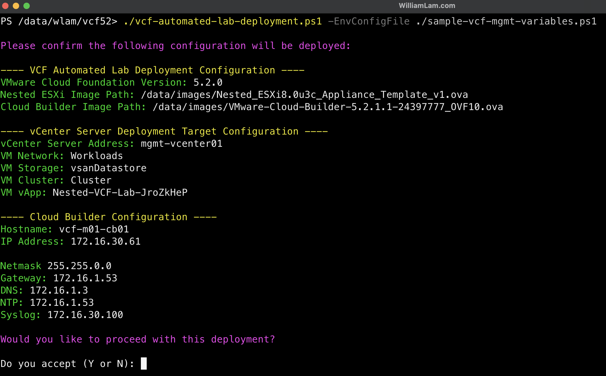

Đây là ví dụ đầu ra của một lần triển khai hoàn chỉnh:

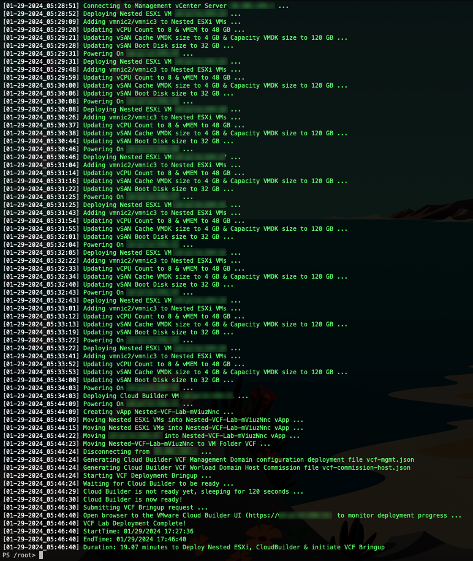

**Lưu ý:** Thời gian triển khai sẽ thay đổi tùy theo tài nguyên cơ sở hạ tầng vật lý bên dưới. Trong lab của tôi, việc này mất ~19 phút để hoàn thành.

Sau khi hoàn thành, bạn sẽ có tám Nested ESXi VM và VMware Cloud Builder VM được đặt trong một vApp.

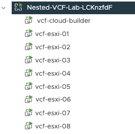

### Triển khai VCF Management Domain

Theo mặc định, script sẽ tự động tạo file triển khai VCF Management Domain `vcf-mgmt.json` dựa trên triển khai cụ thể của bạn và lưu vào thư mục làm việc hiện tại. Ngoài ra, file triển khai VCF sẽ tự động được gửi đến SDDC Manager và bắt đầu quá trình VCF Bringup, mà trong các phiên bản trước đây của script này được thực hiện thủ công bởi người dùng cuối.

Bây giờ bạn chỉ cần mở trình duyệt web đến SDDC Manager và theo dõi tiến trình VCF Bringup.

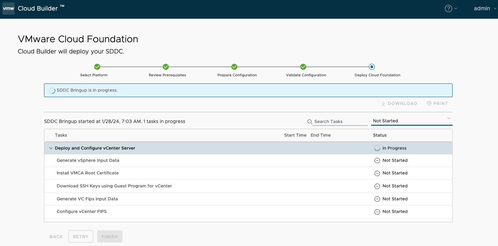

**Lưu ý:** Nếu bạn muốn tắt quá trình VCF Bringup, chỉ cần tìm biến có tên `$startVCFBringup` trong script và đổi giá trị thành 0.

Việc triển khai và cấu hình có thể mất đến vài giờ để hoàn thành tùy thuộc vào tài nguyên phần cứng bên dưới. Trong ví dụ này, việc triển khai mất khoảng ~1.5 giờ và bạn sẽ thấy thông báo thành công như hình dưới đây.

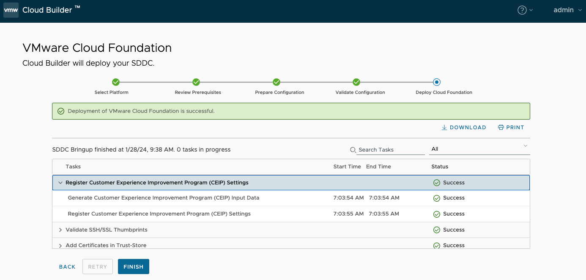

Nhấn nút Finish, bạn sẽ được nhắc đăng nhập vào SDDC Manager. Bạn cần sử dụng thông tin `administrator@vsphere.local` mà bạn đã cấu hình trong script triển khai cho vCenter Server.

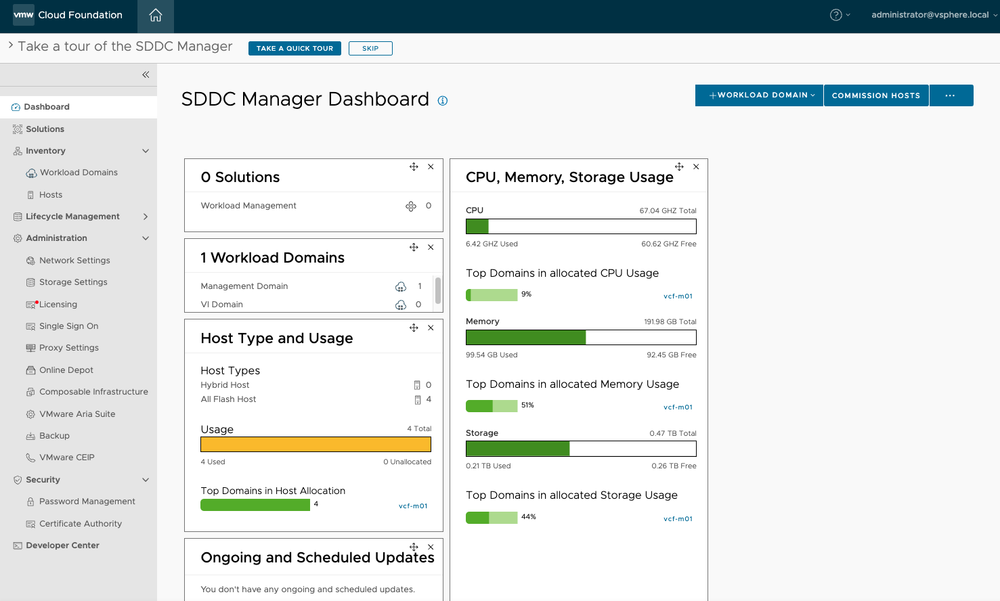

### Triển khai VCF Workload Domain

## Phương pháp thủ công

Theo mặc định, script sẽ tự động tạo file ủy quyền host Workload Domain `vcf-commission-host-ui.json` dựa trên triển khai cụ thể của bạn và lưu vào thư mục làm việc hiện tại.

Sau khi VCF Management Domain đã được triển khai, bạn có thể đăng nhập vào SDDC Manager UI và trong `Inventory->Hosts`, nhấn nút `COMMISSION HOSTS` và tải lên file cấu hình JSON đã tạo.

**Lưu ý:** Hiện có schema JSON khác nhau giữa SDDC Manager UI và API cho host commission, file JSON được tạo chỉ có thể được sử dụng bởi SDDC Manager UI. Đối với API, bạn cần thực hiện một số thay đổi cho file bao gồm thay thế networkPoolName bằng networkPoolId chính xác. Để biết thêm chi tiết, vui lòng tham khảo định dạng JSON trong [VCF Host Commission API](https://developer.broadcom.com/xapis/vmware-cloud-foundation-api/latest/v1/hosts/post/)

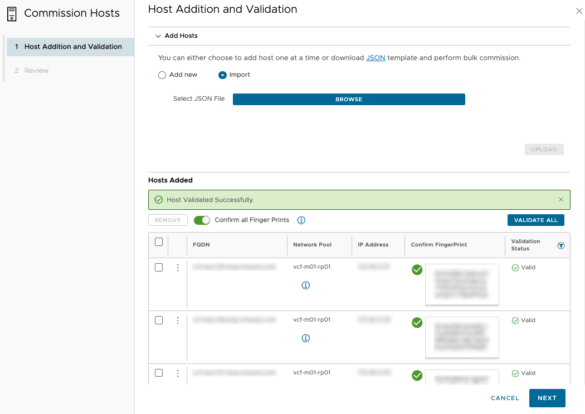

Sau khi các ESXi host đã được thêm vào SDDC Manager, bạn có thể thực hiện triển khai VCF Workload Domain thủ công bằng SDDC Manager UI hoặc API.

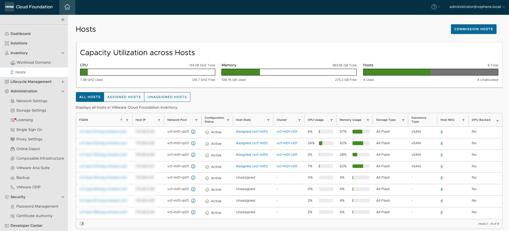

## Phương pháp tự động

Script tự động bổ sung [vcf-automated-workload-domain-deployment.ps1](vcf-automated-workload-domain-deployment.ps1) sẽ được sử dụng để tự động dựng workload domain. Script này giả định rằng file ủy quyền host Workload Domain `vcf-commission-host-api.json` đã được tạo từ việc chạy script triển khai ban đầu và file này sẽ chứa trường "TBD" vì SDDC Manager API yêu cầu Management Domain Network Pool ID, sẽ được tự động lấy khi sử dụng automation bổ sung.

Đây là ví dụ về những gì sẽ được triển khai khi tạo Workload Domain:

|           Hostname          | IP Address    | Chức năng       |
|:---------------------------:|---------------|----------------|
| vcf-w01-vc01.vcf.lab    | 172.16.30.76 | vCenter Server |
| vcf-w01-nsx01.vcf.lab   | 172.16.30.77 | NSX-T VIP      |
| vcf-w01-nsx01a.vcf.lab  | 172.16.30.78 | NSX-T Node 1   |
| vcf-w01-nsx01b.vcf.lab  | 172.16.30.79 | NSX-T Node 2   |
| vcf-w01-nsx01c.vcf.lab  | 172.16.30.80 | NSX-T Node 3   |

> **Lưu ý:** Xem [VMware Cloud Foundation với một ESXi host duy nhất cho Workload Domain?](https://williamlam.com/2023/02/vmware-cloud-foundation-with-a-single-esxi-host-for-workload-domain.html) nếu bạn chỉ muốn triển khai 1 NSX Manager.

### Ví dụ triển khai

Đây là ảnh chụp màn hình khi chạy script nếu tất cả các điều kiện tiên quyết cơ bản đã được đáp ứng và thông báo xác nhận trước khi bắt đầu triển khai:

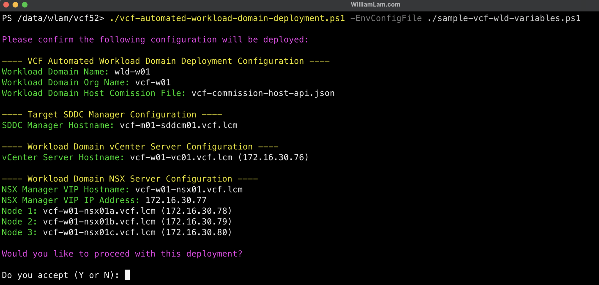

Đây là ví dụ đầu ra của một lần triển khai hoàn chỉnh:

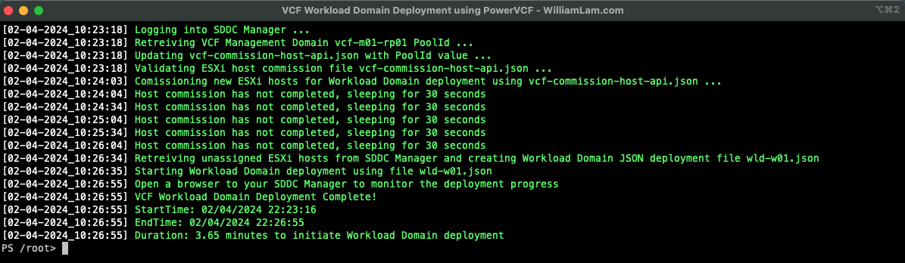

**Lưu ý:** Script sẽ hoàn thành trong ~3-4 phút, nhưng việc tạo Workload Domain thực tế sẽ lâu hơn và phụ thuộc vào tài nguyên của bạn.

Để theo dõi tiến trình triển khai Workload Domain, đăng nhập vào SDDC Manager UI:

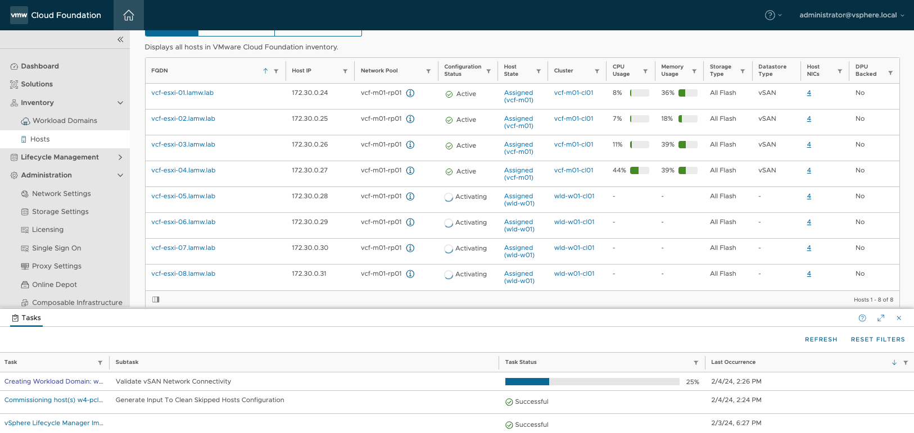

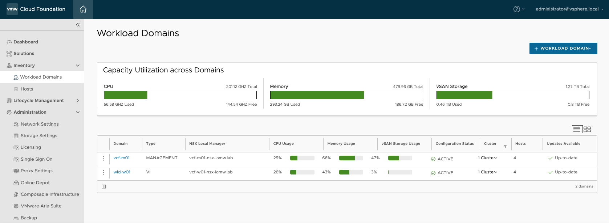

Nếu bây giờ bạn đăng nhập vào vSphere UI của Management Domain, bạn sẽ thấy inventory như sau:

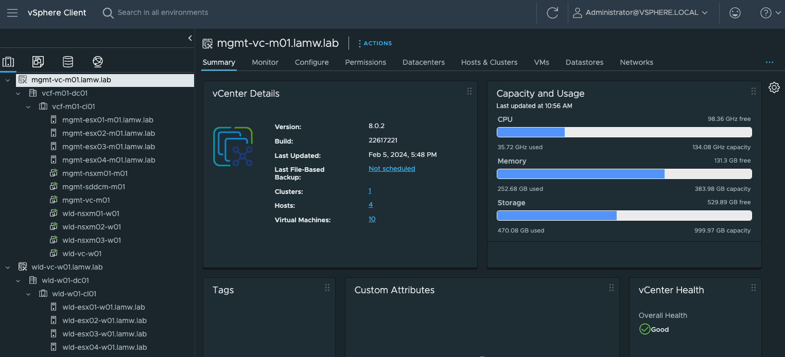
