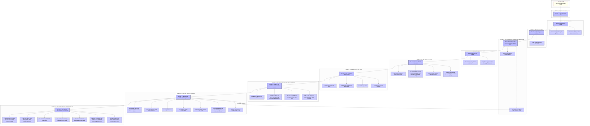

```mermaid
%%{init: {'theme': 'neutral', 'flowchart': {'htmlLabels': true}, 'fontFamily': 'Arial'} }%%
graph TD
    classDef module fill:#bbf,stroke:#333,stroke-width:2px,color:#000;
    classDef task fill:#ccf,stroke:#666,color:#000;
    classDef prereq fill:#ffe,stroke:#daa,stroke-width:2px,color:#000;
    classDef dependency fill:#eee,stroke:#999,stroke-dasharray: 5 5,color:#555;

    subgraph "Yêu cầu chung"
        PREREQ[Môi trường Lab Yêu cầu chung]:::prereq
    end

    subgraph "Mô-đun 1: Giới thiệu khóa học"
        M1[Mô-đun 1: Giới thiệu khóa học]:::module
    end

    subgraph "Mô-đun 2: Giới thiệu về vSAN"
        M2[Mô-đun 2: Giới thiệu về vSAN]:::module
        M2_1["Xem trước giao diện quản lý vSAN"]:::task
        M2_2["Kiểm tra các thiết bị lưu trữ vật lý trên ESXi Host"]:::task
        M2 --> M2_1
        M2 --> M2_2
    end

    subgraph "Mô-đun 3: Xây dựng cụm vSAN"
        M3[Mô-đun 3: Xây dựng cụm vSAN]:::module
        M3_1["Phân tích kịch bản triển khai vSAN"]:::task
        M3 --> M3_1
    end

    subgraph "Mô-đun 4: Tích hợp vSAN với các phần mềm VMware khác"
        M4[Mô-đun 4: Tích hợp vSAN với các phần mềm VMware khác]:::module
        M4_1["Kiểm tra tích hợp với vCenter Server"]:::task
        M4_2["Tạo và kiểm tra máy ảo trên datastore vSAN"]:::task
        M4 --> M4_1
        M4 --> M4_2
    end

    subgraph "Mô-đun 5: Hạn chế của vSAN"
        M5[Mô-đun 5: Hạn chế của vSAN]:::module
        M5_1["Phân tích kịch bản giới hạn của vSAN"]:::task
        M5_2["Mô phỏng vi phạm giới hạn số lượng host tối thiểu"]:::task
        M5 --> M5_1
        M5 --> M5_2
    end

    subgraph "Mô-đun 6: Yêu cầu để kích hoạt vSAN"
        M6[Mô-đun 6: Yêu cầu để kích hoạt vSAN]:::module
        M6_1["Kiểm tra yêu cầu phần cứng trên ESXi Host"]:::task
        M6_2["Xác minh khả năng tương thích phần cứng với HCL (Hardware Compatibility List)"]:::task
        M6_3["Kiểm tra và cấu hình yêu cầu mạng cơ bản"]:::task
        M6_4["Kiểm tra trạng thái giấy phép vSAN (trên vCenter Server)"]:::task
        M6 --> M6_1
        M6 --> M6_2
        M6 --> M6_3
        M6 --> M6_4
    end

    subgraph "Mô-đun 7: Thiết kế và định cỡ cụm vSAN"
        M7[Mô-đun 7: Thiết kế và định cỡ cụm vSAN]:::module
        M7_1["Thiết kế cấu hình lưu trữ vSAN"]:::task
        M7_2["Lập kế hoạch dung lượng trong vSAN"]:::task
        M7_3["Thiết kế mạng vSAN"]:::task
        M7_4["Thiết kế Miền lỗi (Fault Domains)"]:::task
        M7 --> M7_1
        M7 --> M7_2
        M7 --> M7_3
        M7 --> M7_4
    end

    subgraph "Mô-đun 8: Chuẩn bị một cụm mới hoặc hiện có cho vSAN"
        M8[Mô-đun 8: Chuẩn bị một cụm mới hoặc hiện có cho vSAN]:::module
        M8_1["Chuẩn bị bộ điều khiển lưu trữ"]:::task
        M8_2["Đánh dấu/Bỏ đánh dấu thiết bị Flash làm dung lượng (sử dụng ESXCLI)"]:::task
        M8_3["Cấu hình mạng VMkernel cho vSAN trên các host ESXi"]:::task
        M8_4["Kiểm tra khả năng tương thích của vCenter Server với vSAN"]:::task
        M8 --> M8_1
        M8 --> M8_2
        M8 --> M8_3
        M8 --> M8_4
    end

    subgraph "Mô-đun 9: Tạo một cụm vSAN một trang web"
        M9[Mô-đun 9: Tạo một cụm vSAN một trang web]:::module
        M9_1["Sử dụng Bắt đầu nhanh (Quickstart) để tạo cụm vSAN"]:::task
        M9_2["Kích hoạt vSAN thủ công trên cụm hiện có"]:::task
        M9_3["Quản lý Disk Group"]:::task
        M9_4["Chỉnh sửa các cài đặt vSAN cơ bản"]:::task
        M9_5["Cấu hình vSphere HA trên cụm vSAN"]:::task
        M9_6["Tạo máy ảo trên kho dữ liệu vSAN và áp dụng chính sách lưu trữ"]:::task
        M9_7["Tắt vSAN và loại bỏ kho dữ liệu (bài tập cuối)"]:::task
        M9 --> M9_1
        M9 --> M9_2
        M9 --> M9_3
        M9 --> M9_4
        M9 --> M9_5
        M9 --> M9_6
        M9 --> M9_7
    end

    subgraph "Mô-đun 10: Tạo cụm kéo dài vSAN hoặc cụm hai nút"
        M10[Mô-đun 10: Tạo cụm kéo dài vSAN hoặc cụm hai nút]:::module
        M10_1["Thiết kế mạng cho vSAN Stretched Cluster (trên giấy/bảng trắng)"]:::task
        M10_2["Triển khai thiết bị nhân chứng vSAN (vSAN Witness Appliance)"]:::task
        M10_3["Cấu hình mạng trên thiết bị nhân chứng"]:::task
        M10_4["Tạo và cấu hình thủ công vSAN Stretched Cluster"]:::task
        M10_5["Thực hiện kiểm tra tính năng của Stretched Cluster"]:::task
        M10_6["Cấu hình cụm hai nút (Two-Node Cluster) với thiết bị nhân chứng được chia sẻ"]:::task
        M10_7["Chuyển đổi Stretched Cluster thành Standard Cluster (bài tập cuối)"]:::task
        M10 --> M10_1
        M10 --> M10_2
        M10 --> M10_3
        M10 --> M10_4
        M10 --> M10_5
        M10 --> M10_6
        M10 --> M10_7
    end

    %% Flow of modules
    PREREQ --> M1
    M1 --> M2
    M2 --> M3
    M3 --> M4
    M4 --> M5
    M5 --> M6
    M6 --> M7
    M7 --> M8
    M8 --> M9
    M9 --> M10

    %% Specific dependencies
    M9 -- "Cụm vSAN hoạt động" --> M4_2
```
