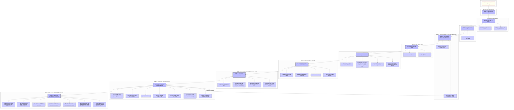
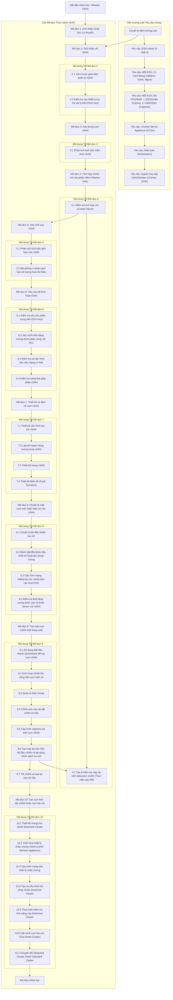

# 1. Cách sửa 1:

```mermaid
%%{init: {'theme': 'neutral', 'flowchart': {'htmlLabels': true}, 'fontFamily': 'Arial'} }%%
graph TD
    classDef module fill:#bbf,stroke:#333,stroke-width:2px,color:#000;
    classDef task fill:#ccf,stroke:#666,color:#000;
    classDef prereq fill:#ffe,stroke:#daa,stroke-width:2px,color:#000;
    classDef dependency fill:#eee,stroke:#999,stroke-dasharray: 5 5,color:#555;

    subgraph "Yêu cầu chung"
        PREREQ[Môi trường Lab Yêu cầu chung]:::prereq
    end

    subgraph "Mô-đun 1: Giới thiệu khóa học"
        M1[Mô-đun 1: Giới thiệu khóa học]:::module
    end

    subgraph "Mô-đun 2: Giới thiệu về vSAN"
        M2[Mô-đun 2: Giới thiệu về vSAN]:::module
        M2_1["Xem trước giao diện quản lý vSAN"]:::task
        M2_2["Kiểm tra các thiết bị lưu trữ vật lý trên ESXi Host"]:::task
        M2 --> M2_1
        M2 --> M2_2
    end

    subgraph "Mô-đun 3: Xây dựng cụm vSAN"
        M3[Mô-đun 3: Xây dựng cụm vSAN]:::module
        M3_1["Phân tích kịch bản triển khai vSAN"]:::task
        M3 --> M3_1
    end

    subgraph "Mô-đun 4: Tích hợp vSAN với các phần mềm VMware khác"
        M4[Mô-đun 4: Tích hợp vSAN với các phần mềm VMware khác]:::module
        M4_1["Kiểm tra tích hợp với vCenter Server"]:::task
        M4_2["Tạo và kiểm tra máy ảo trên datastore vSAN"]:::task
        M4 --> M4_1
        M4 --> M4_2
    end

    subgraph "Mô-đun 5: Hạn chế của vSAN"
        M5[Mô-đun 5: Hạn chế của vSAN]:::module
        M5_1["Phân tích kịch bản giới hạn của vSAN"]:::task
        M5_2["Mô phỏng vi phạm giới hạn số lượng host tối thiểu"]:::task
        M5 --> M5_1
        M5 --> M5_2
    end

    subgraph "Mô-đun 6: Yêu cầu để kích hoạt vSAN"
        M6[Mô-đun 6: Yêu cầu để kích hoạt vSAN]:::module
        M6_1["Kiểm tra yêu cầu phần cứng trên ESXi Host"]:::task
        M6_2["Xác minh khả năng tương thích phần cứng với HCL (Hardware Compatibility List)"]:::task
        M6_3["Kiểm tra và cấu hình yêu cầu mạng cơ bản"]:::task
        M6_4["Kiểm tra trạng thái giấy phép vSAN (trên vCenter Server)"]:::task
        M6 --> M6_1
        M6 --> M6_2
        M6 --> M6_3
        M6 --> M6_4
    end

    subgraph "Mô-đun 7: Thiết kế và định cỡ cụm vSAN"
        M7[Mô-đun 7: Thiết kế và định cỡ cụm vSAN]:::module
        M7_1["Thiết kế cấu hình lưu trữ vSAN"]:::task
        M7_2["Lập kế hoạch dung lượng trong vSAN"]:::task
        M7_3["Thiết kế mạng vSAN"]:::task
        M7_4["Thiết kế Miền lỗi (Fault Domains)"]:::task
        M7 --> M7_1
        M7 --> M7_2
        M7 --> M7_3
        M7 --> M7_4
    end

    subgraph "Mô-đun 8: Chuẩn bị một cụm mới hoặc hiện có cho vSAN"
        M8[Mô-đun 8: Chuẩn bị một cụm mới hoặc hiện có cho vSAN]:::module
        M8_1["Chuẩn bị bộ điều khiển lưu trữ"]:::task
        M8_2["Đánh dấu/Bỏ đánh dấu thiết bị Flash làm dung lượng (sử dụng ESXCLI)"]:::task
        M8_3["Cấu hình mạng VMkernel cho vSAN trên các host ESXi"]:::task
        M8_4["Kiểm tra khả năng tương thích của vCenter Server với vSAN"]:::task
        M8 --> M8_1
        M8 --> M8_2
        M8 --> M8_3
        M8 --> M8_4
    end

    subgraph "Mô-đun 9: Tạo một cụm vSAN một trang web"
        M9[Mô-đun 9: Tạo một cụm vSAN một trang web]:::module
        M9_1["Sử dụng Bắt đầu nhanh (Quickstart) để tạo cụm vSAN"]:::task
        M9_2["Kích hoạt vSAN thủ công trên cụm hiện có"]:::task
        M9_3["Quản lý Disk Group"]:::task
        M9_4["Chỉnh sửa các cài đặt vSAN cơ bản"]:::task
        M9_5["Cấu hình vSphere HA trên cụm vSAN"]:::task
        M9_6["Tạo máy ảo trên kho dữ liệu vSAN và áp dụng chính sách lưu trữ"]:::task
        M9_7["Tắt vSAN và loại bỏ kho dữ liệu (bài tập cuối)"]:::task
        M9 --> M9_1
        M9 --> M9_2
        M9 --> M9_3
        M9 --> M9_4
        M9 --> M9_5
        M9 --> M9_6
        M9 --> M9_7
    end

    subgraph "Mô-đun 10: Tạo cụm kéo dài vSAN hoặc cụm hai nút"
        M10[Mô-đun 10: Tạo cụm kéo dài vSAN hoặc cụm hai nút]:::module
        M10_1["Thiết kế mạng cho vSAN Stretched Cluster (trên giấy/bảng trắng)"]:::task
        M10_2["Triển khai thiết bị nhân chứng vSAN (vSAN Witness Appliance)"]:::task
        M10_3["Cấu hình mạng trên thiết bị nhân chứng"]:::task
        M10_4["Tạo và cấu hình thủ công vSAN Stretched Cluster"]:::task
        M10_5["Thực hiện kiểm tra tính năng của Stretched Cluster"]:::task
        M10_6["Cấu hình cụm hai nút (Two-Node Cluster) với thiết bị nhân chứng được chia sẻ"]:::task
        M10_7["Chuyển đổi Stretched Cluster thành Standard Cluster (bài tập cuối)"]:::task
        M10 --> M10_1
        M10 --> M10_2
        M10 --> M10_3
        M10 --> M10_4
        M10 --> M10_5
        M10 --> M10_6
        M10 --> M10_7
    end

    %% Flow of modules
    PREREQ --> M1
    M1 --> M2
    M2 --> M3
    M3 --> M4
    M4 --> M5
    M5 --> M6
    M6 --> M7
    M7 --> M8
    M8 --> M9
    M9 --> M10

    %% Specific dependencies
    M9 -- "Cụm vSAN hoạt động" --> M4_2
```

---

# Cách sửa 2:

```mermaid
graph TD
    %% Draw.io and Mermaid don't have direct "A4 landscape" commands within the code itself.
    %% This setting is applied when you paste the Mermaid code into Draw.io (or a similar editor).
    %% In Draw.io, after pasting, you'd go to File > Page Setup > Size: A4, Orientation: Landscape.

    START["Bắt đầu khóa học: VMware vSAN"]

    subgraph "Môi trường Lab Yêu cầu chung"
        direction LR
        LAB_REQ["Chuẩn bị Môi trường Lab"]
        LAB_REQ --> LR_ESXI["Yêu cầu: ESXi Hosts (ít nhất 3)"]
        LR_ESXI --> LR_NET["Yêu cầu: Mỗi ESXi: 2+ Card Mạng (vMotion, vSAN, Mgmt)"]
        LR_NET --> LR_RES["Yêu cầu: Mỗi ESXi: Đủ CPU/RAM, 1 SSD/NVMe (Cache), 1+ HDD/SSD (Capacity)"]
        LR_RES --> LR_VCSA["Yêu cầu: vCenter Server Appliance (VCSA)"]
        LR_VCSA --> LR_WS["Yêu cầu: Máy trạm (Workstation)"]
        LR_WS --> LR_ADMIN["Yêu cầu: Quyền truy cập Administrator (vCenter, ESXi)"]
    end

    START --> M1
    M1["Mô-đun 1: Giới thiệu khóa học (Lý thuyết)"]

    %% Kết nối LAB_REQ với mô-đun thực hành đầu tiên
    LAB_REQ --> M2

    subgraph "Các Mô-đun Thực hành vSAN"
        M1 --> M2
        M2["Mô-đun 2: Giới thiệu về vSAN"] --> M2_P_Start
        subgraph "Nội dung TH Mô-đun 2"
            direction LR
            M2_P_Start["2.1 Xem trước giao diện quản lý vSAN"] --> M2_P2["2.2 Kiểm tra các thiết bị lưu trữ vật lý trên ESXi Host"]
        end
        M2_P2 --> M3

        M3["Mô-đun 3: Xây dựng cụm vSAN"] --> M3_P_Start
        subgraph "Nội dung TH Mô-đun 3"
            direction LR
            M3_P_Start["3.1 Phân tích kịch bản triển khai vSAN"]
        end
        M3_P_Start --> M4

        M4["Mô-đun 4: Tích hợp vSAN với các phần mềm VMware khác"] --> M4_P_Start
        subgraph "Nội dung TH Mô-đun 4"
            direction LR
            M4_P_Start["4.1 Kiểm tra tích hợp với vCenter Server"]
            M4_P_Start --> M4_P2["4.2 Tạo & kiểm tra máy ảo trên datastore vSAN (Thực hiện sau M9)"]
        end
        M4_P_Start --> M5
        %% M4.1 là tiền đề cho M5, M4.2 có phụ thuộc sau này

        M5["Mô-đun 5: Hạn chế của vSAN"] --> M5_P_Start
        subgraph "Nội dung TH Mô-đun 5"
            direction LR
            M5_P_Start["5.1 Phân tích kịch bản giới hạn của vSAN"] --> M5_P2["5.2 Mô phỏng vi phạm giới hạn số lượng host tối thiểu"]
        end
        M5_P2 --> M6

        M6["Mô-đun 6: Yêu cầu để kích hoạt vSAN"] --> M6_P_Start
        subgraph "Nội dung TH Mô-đun 6"
            direction LR
            M6_P_Start["6.1 Kiểm tra yêu cầu phần cứng trên ESXi Host"] --> M6_P2["6.2 Xác minh khả năng tương thích phần cứng với HCL"]
            M6_P2 --> M6_P3["6.3 Kiểm tra và cấu hình yêu cầu mạng cơ bản"]
            M6_P3 --> M6_P4["6.4 Kiểm tra trạng thái giấy phép vSAN"]
        end
        M6_P4 --> M7

        M7["Mô-đun 7: Thiết kế và định cỡ cụm vSAN"] --> M7_P_Start
        subgraph "Nội dung TH Mô-đun 7"
            direction LR
            M7_P_Start["7.1 Thiết kế cấu hình lưu trữ vSAN"] --> M7_P2["7.2 Lập kế hoạch dung lượng trong vSAN"]
            M7_P2 --> M7_P3["7.3 Thiết kế mạng vSAN"]
            M7_P3 --> M7_P4["7.4 Thiết kế Miền lỗi (Fault Domains)"]
        end
        M7_P4 --> M8

        M8["Mô-đun 8: Chuẩn bị một cụm mới hoặc hiện có cho vSAN"] --> M8_P_Start
        subgraph "Nội dung TH Mô-đun 8"
            direction LR
            M8_P_Start["8.1 Chuẩn bị bộ điều khiển lưu trữ"] --> M8_P2["8.2 Đánh dấu/Bỏ đánh dấu thiết bị Flash làm dung lượng"]
            M8_P2 --> M8_P3["8.3 Cấu hình mạng VMkernel cho vSAN trên các host ESXi"]
            M8_P3 --> M8_P4["8.4 Kiểm tra khả năng tương thích của vCenter Server với vSAN"]
        end
        M8_P4 --> M9

        M9["Mô-đun 9: Tạo một cụm vSAN một trang web"] --> M9_P_Start
        subgraph "Nội dung TH Mô-đun 9"
            direction LR
            M9_P_Start["9.1 Sử dụng Bắt đầu nhanh (Quickstart) để tạo cụm vSAN"] --> M9_P2["9.2 Kích hoạt vSAN thủ công trên cụm hiện có"]
            M9_P2 --> M9_P3["9.3 Quản lý Disk Group"]
            M9_P3 --> M9_P4["9.4 Chỉnh sửa các cài đặt vSAN cơ bản"]
            M9_P4 --> M9_P5["9.5 Cấu hình vSphere HA trên cụm vSAN"]
            M9_P5 --> M9_P6["9.6 Tạo máy ảo trên kho dữ liệu vSAN và áp dụng chính sách lưu trữ"]
            M9_P6 --> M9_P7["9.7 Tắt vSAN và loại bỏ kho dữ liệu"]
        end
        M9_P6 --> M4_P2
        %% Thực hiện bước 4.2 sau khi cụm vSAN được tạo và có VM

        M9_P7 --> M10
        M10["Mô-đun 10: Tạo cụm kéo dài vSAN hoặc cụm hai nút"] --> M10_P_Start
        subgraph "Nội dung TH Mô-đun 10"
            direction LR
            M10_P_Start["10.1 Thiết kế mạng cho vSAN Stretched Cluster"] --> M10_P2["10.2 Triển khai thiết bị nhân chứng vSAN (vSAN Witness Appliance)"]
            M10_P2 --> M10_P3["10.3 Cấu hình mạng trên thiết bị nhân chứng"]
            M10_P3 --> M10_P4["10.4 Tạo và cấu hình thủ công vSAN Stretched Cluster"]
            M10_P4 --> M10_P5["10.5 Thực hiện kiểm tra tính năng của Stretched Cluster"]
            M10_P5 --> M10_P6["10.6 Cấu hình cụm hai nút (Two-Node Cluster)"]
            M10_P6 --> M10_P7["10.7 Chuyển đổi Stretched Cluster thành Standard Cluster"]
        end
        M10_P7 --> END["Kết thúc khóa học"]
    end
```

